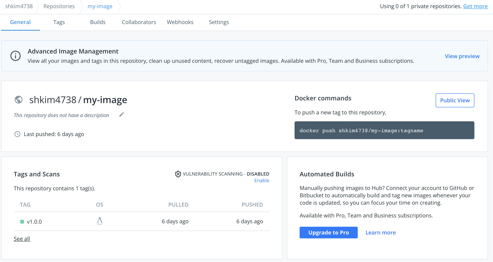

# 4. Docker Image

## 4.1 Docker Image와 Dockerfile

- Docker Image
  - 어떤 애플리케이션에 대해서, 단순히 애플리케이션 코드 뿐만이 아니라 그 애플리케이션과 dependent한 모든 것을 함께 패키징한 데이터

- Dockerfile
  - 사용자가 도커 이미지를 쉽게 만들 수 있도록 제공하는 탬플릿


## 4.2 Dockerfile

### 4.2.1 Dockerfile 만들기

```bash
# home 디렉토리로 이동
cd $HOME

# docker-practice라는 폴더 생성
mkdir docker-practice

# docker-practice 폴더로 이동
cd docker-practice

# Dockerfile 이라는 빈 파일 생성
touch Dockerfile
```


### 4.2.2 기본 명령어

- Dockerfile에서 사용할 수 있는 기본적인 명령어에 대해서 하나씩 알아보자.
  - 지금 모든 사용법을 자세히 알아야 할 필요는 없으며, 필요한 경우에 구글링할 수 있을 정도면 충분하다.


#### 4.2.2.1 `FROM`

```dockerfile
FROM <image>[:<tag>] [AS <name>]

# 예시
FROM ubuntu
FROM ubuntu:18.04
FROM nginx:latest AS ngx
```

- Dockerfile이 base image로 어떤 이미지를 사용할 것인지를 명시하는 명령어


#### 4.2.2.2 `COPY`

```dockerfile
COPY <src>... <dest>

# 예시
COPY a.txt /some-directory/b.txt
COPY my-directory /some-directory-2
```

- `<src>` 의 파일 혹은 디렉토리를 `<dest>` 경로에 복사하는 명령어


#### 4.2.2.3 `RUN`

```dockerfile
RUN <command>
RUN ["executable-command", "parameter1", "parameter2"]

# 예시
RUN pip install torch
RUN pip install -r requirements.txt
```

- 명시한 커맨드를 도커 컨테이너에서 실행하는 것을 명시하는 명령어


#### 4.2.2.4 `CMD`

```dockerfile
CMD <command>
CMD ["executable-command", "parameter1", "parameter2"]
CMD ["parameter1", "parameter2"] # ENTRYPOINT 와 함께 사용될 때

# 예시
CMD python main.py
CMD 
```

- 명시한 커맨드를 도커 컨테이너가 **시작될 때**, 실행하는 것을 명시하는 명령어
  - 비슷한 역할을 하는 명령어로 `ENTRYPOINT` 가 있다.
- 하나의 Docker Image에서는 하나의 `CMD` 만 실행할 수 있다는 점에서 `RUN` 명령어와의 차이가 있다.


#### 4.2.2.5 `WORKDIR`

```dockerfile
WORKDIR /path/to/workdir

# 예시
WORKDIR /home/demo
```

- 이후 작성될 명령어를 컨테이너 내의 어떤 디렉토리에서 수행할 것인지를 명시하는 명령어
- 해당 디렉토리가 없으면 생성한다.


#### 4.2.2.6 `ENV`

```dockerfile
ENV <key> <value>
ENV <key>=<value>

# 예시
# default 언어 설정
RUN locale-gen ko_KR.UTF-8
ENV LANG ko_KR.UTF-8
ENV LANGUAGE ko_KR.UTF-8
ENV LC_ALL ko_KR.UTF-8
```

- 컨테이너 내부에서 지속적으로 사용될 environment variable 의 값을 설정하는 명령어


#### 4.2.2.7 `EXPOSE`

```dockerfile
EXPOSE <port>
EXPOSE <port>/<protocol>

# 예시
EXPOSE 8080
```

- 컨테이너에서 뚫어줄 포트/프로토콜을 지정할 수 있다.
- protocol 을 지정하지 않으면 TCP 가 디폴트로 설정된다.


### 4.2.3 간단한 Dockerfile 작성

```dockerfile
# Dockerfile

# base image 를 ubuntu 18.04 로 설정합니다.
FROM ubuntu:18.04

# apt-get update 명령을 실행합니다.
RUN apt-get update

# DOCKER CONTAINER 가 시작될 때, "Hello World" 를 출력합니다.
CMD ["echo", "Hello World"]
```


## 4.3 Docker build from Dockerfile

`docker build` 명령어로 Dockerfile로부터 Docker Image를 만들어보자.

```bash
# Dockerfile이 있는 경로에서 다음 명령을 실행
docker build -t my-image:v1.0.0 .
```

- `my-image:v1.0.0`
  - `my-image`: 도커 이미지 이름
  - `v1.0.0`: 도커 이미지 태그
- `.`
  - 현재 경로에 있는 Dockerfile 로부터 도커 이미지를 생성한다.


정상적으로 이미지가 빌드되었는 지 확인

```bash
docker images | grep my-image
```


빌드한 `my-image:v1.0.0` 이미지로 도커 컨테이너 run

```bash
docker run my-image:v1.0.0
```


## 4.4 Docker Image 저장소

### 4.4.1 Docker Registry

- [Docker Registry 공식 문서](https://docs.docker.com/registry)

- 간단하게 도커 레지스트리를 직접 띄어본 뒤, 이전에 빌드한 `my-image:v1.0.0` 를 도커 레지스트리에 push 해보자.

- Docker Registry는 이미 잘 준비된 도커 컨테이너가 존재하므로, 쉽게 사용할 수 있다.


Docker Registry 컨테이너 띄우기

```bash
docker run -d -p 5000:5000 --name registry registry

docker ps
```

- 정상적으로 registry 이미지가 registry 라는 이름으로 생성된 것을 확인할 수 있다.
- `localhost:5000` 으로 해당 registry 와 통신할 수 있다.


`my-image` 를 방금 생성한 registry를 바라보도록 tag

```bash
docker tag my-image:v1.0.0 localhost:5000/my-image:v1.0.0

docker images | grep my-images
```

- `localhost:5000/my-image:v1.0.0` 라는 이름의 이미지가 생성된 것을 확인


`my-image` 를 registry에 push

```bash
docker push localhost:5000/my-image:v1.0.0
```


정상적으로 push 되었는 지 확인

```bash
# localhost:5000 이라는 registry 에 어떤 이미지가 저장되어 있는지 리스트를 출력하는 명령
$ curl -X GET http://localhost:5000/v2/_catalog

# 출력 : {"repositories":["my-image"]}

# my-image 라는 이미지 네임에 어떤 태그가 저장되어있는지 리스트를 출력하는 명령
$ curl -X GET http://localhost:5000/v2/my-image/tags/list

# 출력 : {"name":"my-image","tags":["v1.0.0"]}
```


### 4.4.2 Docker Hub

- [Docker Hub 사이트](https://hub.docker.com)


Docker Hub login

```bash
docker login

# username, password 입력
# Login Succeeded!
```


Docker Hub을 바라보도록 tag 생성

```bash
docker tag my-image:v1.0.0 shkim4738/my-image:v1.0.0

# docker tag <image-name>:<tag-name> <docker-hub-user-name>/<image-name>:<tag-name>
```


Docker Image push to Docker Hub

```bash
docker push shkim4738/my-image:v1.0.0

# docker push <docker-hub-user-name>/<image-name>:<tag-name>
```


Docker Hub의 본인 계정에서 업로드한 이미지 확인

