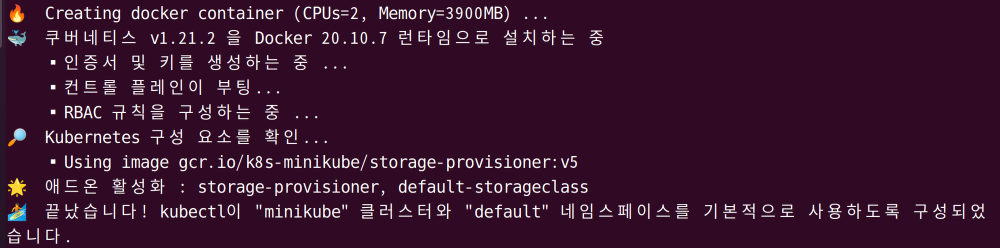

# 7. 쿠버네티스 실습 2 - minikube 설치

## 7.1 Prerequisite

### 7.1.1 References

- [minikube](https://minikube.sigs.k8s.io/docs/start/)
- [kubectl](https://kubernetes.io/ko/docs/tasks/tools/install-kubectl-linux/)


### 7.1.2 minikube 설치 최소 사양

- CPU
  - 2 core 이상
- Memory
  - 2GB 이상
- Disk
  - 20GB 이상

- 가상화 tool
  - Docker, Hyperkit, Hyper-V, ...


### 7.1.3 VM 스펙 업그레이드 필요

- CPU
  - multicore (3개 이상)
- Disk
  - 40GB 이상


## 7.2 Install Minikube

minikube의 최신 버전(v.1.22.0) 바이너리 다운 및 실행할 수 있도록 변경

```bash
# amd 기반
curl -LO https://storage.googleapis.com/minikube/releases/v1.22.0/minikube-linux-amd64
sudo install minikube-linux-amd64 /usr/local/bin/minikube
```

```bash
# arm 기반
curl -LO https://storage.googleapis.com/minikube/releases/v1.22.0/minikube-darwin-arm64
sudo install minikube-darwin-arm64 /usr/local/bin/minikube
```


정상 다운로드 확인

```bash
minikube --help
```

- 터미널에 help 관련 메세지가 출력되면 정상적으로 설치된 것이다.


minikube 버전 확인

```bash
minikube version
```


## 7.3 Install Kubectl

kubectl는 kubernetes cluster(server)에 요청을 간편하게 보내기 위해서 널리 사용되는 client xnf


kubectl은 v1.22.1 으로 다운로드

```bash
# amd 기반
curl -LO https://dl.k8s.io/release/v1.22.1/bin/linux/amd64/kubectl
```

```bash
# arm 기반
curl -LO "https://dl.k8s.io/release/v1.22.1/bin/darwin/arm64/kubectl"
```


kubectl 바이너리를 사용할 수 있도록 권한과 위치 변경

```bash
sudo install -o root -g root -m 0755 kubectl /usr/local/bin/kubectl
```


정상 설치 확인

```bash
kubectl --help
```

- 터미널에 help 관련 메세지가 출력되면 정상적으로 설치된 것이다.


kubectl 버전 확인

```bash
kubectl version
```

```
Client Version: version.Info{Major:"1", Minor:"22", GitVersion:"v1.22.4", GitCommit:"b695d79d4f967c403a96986f1750a35eb75e75f1", GitTreeState:"clean", BuildDate:"2021-11-17T15:48:33Z", GoVersion:"go1.16.10", Compiler:"gc", Platform:"darwin/arm64"}
The connection to the server localhost:8080 was refused - did you specify the right host or port?
```

- `The connection to the server localhost:8080 was refused - did you specify the right host or port?`
  - 위 메세지는 에러를 의미하는 것이 맞다.
  - 하지만 `kubectl version` 은 client의 버전과 kubernetes server의 버전을 모두 출력하는 명령어이며, 현재 kubernetes server를 생성하지 않았기 때문에 client의 버전만 정상적으로 출력된다.


## 7.4 Minikube 시작하기

### 7.4.1 minikube start

- minikube를 docker driver를 기반으로 하여 시작한다.

  ```bash
  minikube start --driver=docker
  ```

- 다음과 같은 화면이 출력되면서 필요한 docker image들을 다운받게 되고, 다운로드가 완료되면 이를 기반으로 minikube를 구동한다.

  

- 정상적으로 `minikube start` 가 완료되면 다음과 같은 메세지가 출력된다.

  


### 7.4.2 minikube status

- 정상적으로 생성되었는 지 minikube의 상태를 확인

  ```bash
  minikube status
  ```

- 터미널에 다음과 같은 메세지가 출력되야 한다.

  ```
  minikube
  type: Control Plane
  host: Running
  kubelet: Running
  apiserver: Running
  kubeconfig: Configured
  ```


### 7.4.3 kubectl get pod -n kube-system

- kubectl을 사용하여 minikube 내부의 default pod들이 정상적으로 생성되었는 지 확인한다.

  ```bash
  kubectl get pod -n kube-system
  ```

- 터미널에 다음과 같은 메세지가 출력되야 한다.

  ```
  NAME                               READY   STATUS    RESTARTS   AGE
  coredns-558bd4d5db-bwkjv           1/1     Running   0          3m40s
  etcd-minikube                      1/1     Running   0          3m46s
  kube-apiserver-minikube            1/1     Running   0          3m46s
  kube-controller-manager-minikube   1/1     Running   0          3m53s
  kube-proxy-ppgbx                   1/1     Running   0          3m40s
  kube-scheduler-minikube            1/1     Running   0          3m46s
  storage-provisioner                1/1     Running   1          3m51s
  ```


## 7.5 Minikube 삭제하기

### 7.5.1 minikube delete

- 다음 명령어로 간단하게 삭제할 수 있다.

  ```bash
  minikube delete
  ```

