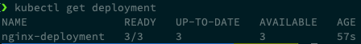
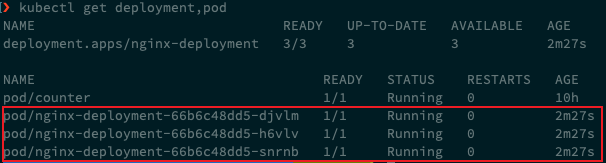
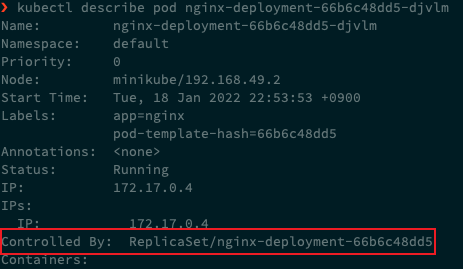
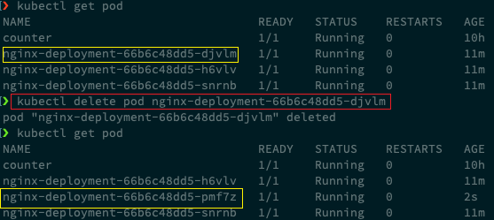
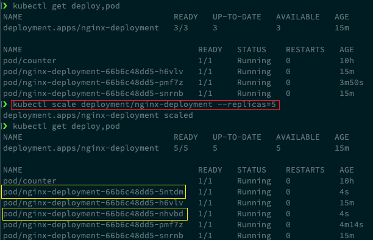
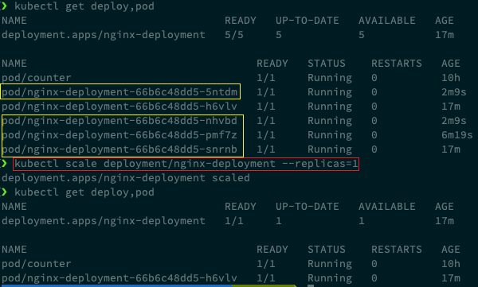
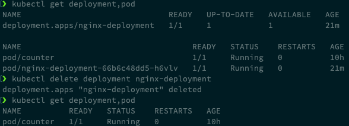

# 9. 쿠버네티스 실습 4 - Deployment

## 9.1 Deployment 란?

- Deployment는 Pod와 Replicaset(레플리카셋)에 대한 관리를 제공하는 단위이다.
- [쿠버네티스 공식 문서 - deployment](https://kubernetes.io/ko/docs/concepts/workloads/controllers/deployment/)

- **관리**라는 의미는 self-healing, scaling, rollout(무중단 업데이트)과 같은 기능을 포함한다.
- 쉽게 생각해 Deployment는 Pod을 감싼 개념이라고 볼 수 있다.
  - Pod을 Deployment로 배포함으로서 여러 개로 복제된 Pod, 여러 버전의 Pod을 안전하게 관리할 수 있다.


## 9.2 Deployment 생성

### 9.2.1 간단한 Deployment 예시

```yaml
apiVersion: apps/v1 # kubernetes resource의 API Version
kind: Deployment # kubernetes resource name
metadata: # 메타 데이터 : name, namespace, labels, annotations 등을 포함
  name: nginx-deployment
  labels:
    app: nginx
spec: # 메인 파트 : resource의 desired state를 명시
  replicas: 3 # 동일한 template의 pod을 3개 복제본으로 생성
  selector:
    matchLabels:
      app: nginx
  template: # Pod의 template을 의미
    metadata:
      labels:
        app: nginx
    spec:
      containers:
      - name: nginx # container의 이름
        image: nginx:1.14.2 # container의 이미지
        ports:
        - containerPort: 80 # container의 내부 port
```


### 9.2.2 Deployment 생성

```bash
vi deployment.yaml

# 9.2.1 내용 붙여넣기

kubectl apply -f deployment.yaml
```


## 9.3 Deployment 조회

생성한 Deployment의 상태 확인

```bash
kubectl get deployment
```




deployment와 함께 3개의 pod이 생성된 것을 확인할 수 있다.

```bash
kubectl get deployment,pod
```




deployment와 함께 생성된 pod의 정보를 자세히 조회

```bash
kubectl describe pod nginx-deployment-66b6c48dd5-djvlm
# kubectl describe pod <pod-name>
```



- `Controlled By` 로부터 Deployment에 의해 생성되고 관리되고 있는 것을 확인할 수 있다.


## 9.4 Deployment Auto-healing

pod을 하나 삭제해보면, 기존 pod이 삭제되고, 동일한 pod이 새로 하나 생성된 것을 확인할 수 있다.

```bash
# 현재 pod 목록 확인
kubectl get pod

# 기존 pod 삭제
kubectl delete pod nginx-deployment-66b6c48dd5-djvlm
# kubectl delete pod <pod-name>

# 새로 갱신된 pod 목록 확인
kubectl get pod
```




## 9.5 Deployment Scaling

### 9.5.1 replica 개수 늘려보기

```bash
kubectl get deployment,pod

kubectl scale deployment/nginx-deployment --replicas=5

kubectl get deployment,pod
```




### 9.5.2 replica 개수 줄여보기

```bash
kubectl get deployment,pod

kubectl scale deployment/nginx-deployment --replicas=1

kubectl get deployment,pod
```




## 9.6 Deployment 삭제

```bash
kubectl get deployment,pod

# deployment 삭제
kubectl delete deployment nginx-deployment
# kubectl delete deployment <deployment-name>

kubectl get deployment,pod
```



- Deployment의 Control을 받던 pod 역시 모두 삭제된 것을 확인할 수 있다..


`-f` 옵션으로 YAML 파일을 사용해서도 삭제할 수 있다.

```bash
kubectl delete -f <deployment-yaml-file-path>
```

