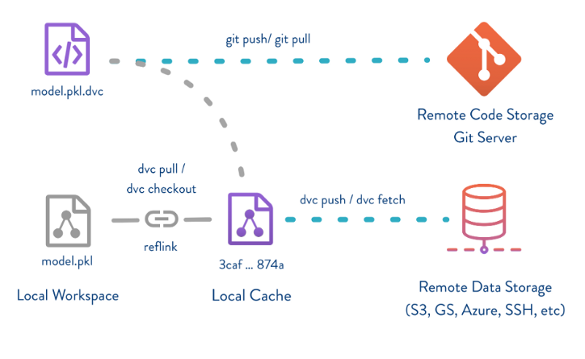

# 1. Data Management 란

## 1.1 다양한 버전의 데이터

- Raw 데이터를 다양한 변형을 가하면서 다양한 버전의 데이터가 생성된다.

- 파일명으로 데이터를 구분하는 방법 보단 더 좋은 방법이 있다.

## 1.2 Git

- Source code Version Control Tool
- 형상 관리 도구

## 1.3 Github is not for Large Data

- 다른 사람과 협업하기 위해서는 git을 호스팅 해주는 서비스인 Github, GitLab, Bibucket과 같은 서비스를 사용한다.
- 하지만 이런 서비스는 대용량 데이터를 사용하기에는 적합하지 않다.

## 1.4 For Large Data

- Git과 함께 사용하여 소스 코드와 데이터를 함께 관리할 수 있는 다양한 툴들이 존재한다.
  - DVC
  - Pachyderm
  - Delta Lake
  - Dolt

## 1.5 DVC

- Data Version Control
- [https://dvc.org](https://dvc.org)

- 오픈 소스
- 사용법이 git과 유사하다.
- data versioning

## 1.6 DVC 특징

- 대부분의 스토리지와 호환
  - ex) amazon s3, google drive, ...
- Github 외의 GitLab, Bitbucket 등의 대부분의 git 호스팅 서버와 연동
- Data Pipeline을 DAG로 관리
- Git과 유사한 인터페이스

## 1.7 DVC 저장 방식

- 실제 데이터는 스토리지에 저장
- github repo에는 데이터에 대한 메타 데이터만 저장
- 이 과정을 DVC가 자동화한다.
- 파이썬 API도 제공
