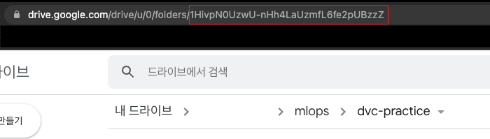

# 2. DVC 실습

## 2.1 DVC 설치

### 2.1.1 Python 설치


### 2.1.2 git 설치


### 2.1.3 DVC 설치

- dvc 2.6.4 버전 다운로드

```bash
pip install dvc[all]==2.6.4
```

- `[all]`
  - dvc의 remote storage로 s3, gs, azure, oss, ssh 모두를 사용할 수 있도록 관련 패키지를 함께 설치하는 옵션


## 2.2 DVC 저장소 세팅

### 2.2.1 새로운 디렉토리 생성

```bash
mkdir dvc-practice
cd dvc-practice
```


### 2.2.2 git 저장소 초기화

```
git init
```


### 2.2.3 dvc 저장소 초기화

```bash
dvc init
```


## 2.3 DVC 기본 명령 1 (`dvc add`, `dvc push`)

### 2.3.1 데이터 생성

DVC로 버전 트래킹할 데이터를 생성한다.

```bash
mkdir data
cd data

# 가볍게 변경할 수 있는 데이터 생성
vi demo.txt

cat demo.txt
```


### 2.3.2 데이터 트래킹

생성한 데이터를 dvc로 트래킹한다.

```bash
cd .. # dvc-practice

dvc add data/demo.txt

# To track the changes with git, run:
git add data/demo.txt.dvc data/.gitignore
```


### 2.3.3 자동으로 생성된 파일 확인

`dvc add` 에 의해 자동으로 생성된 파일들을 확인한다.

```bash
cd data

# demo.txt.dvc, .gitignore 파일이 자동 생성된 것 확인
ls
```

```bash
cat demo.txt.dvc
```

- `demo.txt` 파일의 메타 정보를 가진 파일

- git에서는 `demo.txt` 파일이 아닌, `demo.txt.dvc` 파일만 관리하게 된다.

  

### 2.3.4 git commit 수행

```bash
git commit -m "Add demo.txt.dvc"
```

- `.dvc` 파일은 `git push`를 수행하여, git repository에 저장한다.


### 2.3.5 remote storage 세팅

데이터가 실제로 저장될 remote storage를 세팅한다.

- google drive에 새로운 폴더를 하나 생성한 뒤, URL로부터 ID를 복사한다.

  

- dvc의 default remote storage로 `drive://<GOOGLE_DRIVE_FOLDER_ID>` 를 세팅한다.

  ```bash
  dvc remote add -d storage gdrive://1HivpN0UzwU-nHh4LaUzmfL6fe2pUBzzZ
  ```


### 2.3.6 dvc config를 git commit

```bash
git add .dvc/config

git commit -m "add remote storage"
```


### 2.3.7 dvc push

데이터를 remote storage에 업로드한다.

```bash
dvc push
```

- `dvc push`를 수행하기 위해서는 인증 과정이 필요하다.
- 터미널에 표시되는 링크를 클릭하여 dvc의 google drive에 대한 접근 권한을 부여한 후 생성되는 키를 터미널에 다시 붙여넣는다.

- 구글 드라이브레 파일이 정상적으로 업로드되었는 지 확인한다.
  - 새로운 폴더가 하나 생성되고, 폴더 내부에 긴 이름의 파일이 하나 업로드된 것을 확인할 수 있다.
  - 이 파일을 다운로드 받은 뒤 열어보면 업로드한 파일과 동일한 파일임을 확인할 수 있다.


## 2.4 DVC 기본 명령 2 (`dvc pull`, `dvc checkout`)

### 2.4.1 dvc pull

데이터를 remote storage로부터 다운로드한다.

```bash
cd dvc-practice

# dvc 캐시 삭제
rm -rf .dvc/cache/

# dvc push 했던 데이터 삭제
rm -rf data/demo.txt

# dvc pull로 google drive에 업로드했던 데이터를 다운
dvc pull

# 방금 다시 다운받은 데이터가 이전 데이터와 동일한지 확인
cat data/demo.txt
```


### 2.4.2 dvc checkout

데이터의 버전을 변경하는 명령어

버전 변경 테스트를 위해, 새로운 버전의 데이터를 dvc push 한다.

```bash
# 데이터를 변경
vi data/demo.txt

# 데이터 변경

# 변경되었는 지 확인
cat data/demo.txt

# dvc add (data/demo.txt.dvc를 변경시켜주는 역할)
dvc add data/demo.txt

# git add and commit
git add data/demo.txt.dvc
git commit -m "update demo.txt"

# dvc push (and git push)
dvc push # 새로운 버전의 데이터 파일을 remote storage에 업로드

# .dvc 파일을 git repository에 업로드
git push
```

- 구글 드라이브로 이동하여 새로운 파일이 정상적으로 업로드되었는 지 확인한다.
  - 새로운 폴더가 추가로 생성되고, 폴더 내부에 긴 이름의 파일이 하나 업로드된 것을 확인할 수 있다.
  - 이 파일을 다운로드 받은 뒤 열어보면 업로드한 파일과 동일한 파일임을 확인할 수 있다.


이전 버전의 데이터로 되돌아가보자.

```bash
# git log 확인
git log --oneline

# demo.txt.dvc 파일을 이전 commit 버전으로 되돌린다.
git checkout <COMMIT_HASH> data/demo.txt.dvc

# dvc checkout (demo.txt.dvc의 내용을 보고 demo.txt 파일을 이전 버전으로 변경)
dvc checkout

# 데이터가 변경되었는 지 확인
cat data/demo.txt
```


## 2.5 DVC의 추가 기능

- Python API를 사용한 제어
  - [https://dvc.org/doc/api-reference](https://dvc.org/doc/api-reference)
- S3, HDFS, SSH 등의 remote storage 연동
- DAG를 통한 Data pipeline 관리
  - [https://dvc.org/doc/start/data-pipelines](https://dvc.org/doc/start/data-pipelines)
- `dvc metrics`, `dvc plots` 를 사용한 각 실험의 metrics 기록 및 시각화

