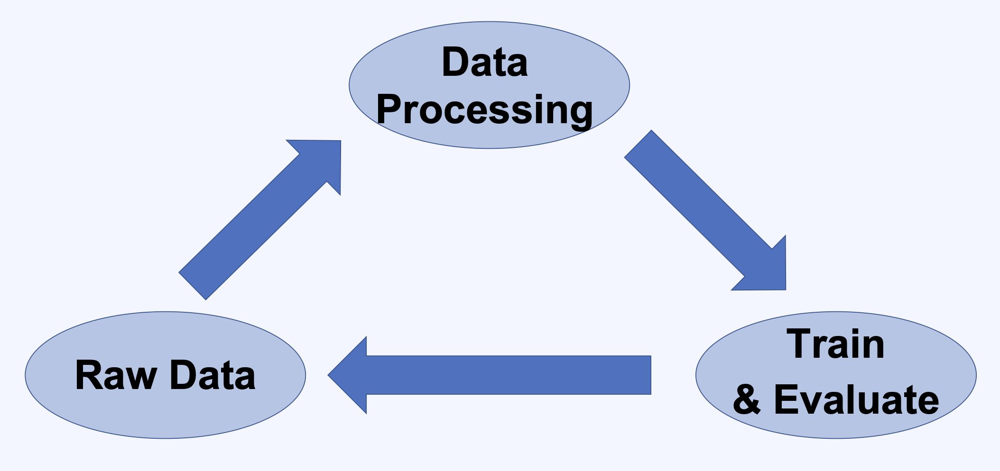

# 1. Model Managaement 란?

## 1.1 ML Model의 Life Cycle

## 1.2 기록해야 할 정보들

- Model 소스 코드
- Evaluation Metric 결과
- 사용한 parameters
- `model.pkl` 파일
- 학습에 사용한 데이터
- 데이터 전처리용 코드
- 전처리된 데이터
- 기타 등등

## 1.3 모델 관련 정보의 저장 방식이 다른 경우

- 사람마다 저장하는 방식이 다르면 협업하기 어렵다.
- 관리하기도 어렵고 실수할 여지도 있다.

## 1.4 ML Model Life Cycle 관리의 어려움

- 비슷한 작업이 반복적으로 일어난다.
- Dependency 패키지들이 많으며, 버전 관리가 어렵다.
- 사람 Dependency가 생긴다.
- 테스트하기 어렵다.
- Reproduce 되지 않는 경우가 많다.
- Model 학습용 코드를 구현하는 사람과 Serving 용 코드를 구현하는 사람이 분리되어 있다.

## 1.5 다양한 Model Management Tools

- MLflow
- Tensorboard
- Neptune
- Weights & Biases
- Comet.ml

## 1.6 MLflow

### 1.6.1 구성 요소

- mlflow tracking
  - 모델의 하이퍼파라미터나 코드를 변경시켜가면서 실험을 할 때 각각의 모델 버전의 metric을 기록하는 중앙 저장소를 제공
  - 모델 개발자들이 쉽게 트래킹 서버에 기록할 수 있도록 파이썬 또는 R 함수로 간단하게 메타정보와 모델을 함께 기록할 수 있게 하는 API를 제공
  - 기록할 수 있는 메타 정보들
    - 파라미터, metric, 소스 코드의 버전, 날짜, 패키징된 모델 파일, 학습에 사용한 데이터, 모델 description, 태그
- mlflow projects
  - 모델 학습 코드가 reproducible(성능을 재현)할 수 있도록 파라미터의 데이터 타입, 파이토치 및 텐서플로 버전, 콘다 버전, 도커 버전 등 모델에 의존성이 있는 모든 정보들을 함께 넣어서 코드를 패키징 해줌
- mlflow models
  - 모델이 어떤 형태로 개발되었는 지와 상관없이 항상 통일된 형태로 배포에 사용될 수 있도록 포맷화 시켜주는 기능
  - 특정 프레임워크나 언어에 종속되지 않고 동일한 형태로 배포될 수 있도록 포맷화
- mlflow model registry
  - mlflow로 실험했던 모델을 저장하고 관리하는 저장소
  - 실험한 모델을 배포에 사용하기 위해서 모델의 성숙 단계를 production stage, staging stage와 같은 형태로 표시할 수 있음
  - model registry에 등록된 모델은 mlflow CLI를 통해서 간편하게 서빙까지 이어질 수 있게 된다.
  - CLI 뿐만 아니라 Python API 도 제공한다.
  - 등록된 모델을 파이썬 코드를 통해 load하여 사용할 수도 있다.
  - 실무에서 서빙 단계를 고려해야 한다면 mlflow model registry가 유용하게 사용될 수 있다.

### 1.6.2 MLflow tracking의 구조

- 기본적인 server-client 구조를 갖고 있다.
- tracking server
  - local file system
  - sqlite, postgreSQL와 같은 DB를 backend로 사용
  - client가 저장해달라고 요청한 모델 및 모델 관련 메타정보들을 벡엔드 스토리지에 저장
  - 추후 client가 정보를 요청할 때 DB를 확인해 정보를 돌려준다.
  - 메타정보 이외의 모델과 관련된 큰 데이터들은 artifact store를 따로 지정하여 AWS S3 등과 같은 object storage에 저장도 가능하다.
- tracking UI
  - 쉬운 접근성을 위해 UI 제공
  - 실험 결과 리스트 확인

### 1.6.3 MLflow 장점

- 쉬운 설치
- 쉬운 Migration
- 대시보드 제공
- 다양한 Client API 제공
- 다양한 Backend Storage 연동 지원
- 다양한 Artifact Storage 연동 지원
- 오픈 소스이다.

