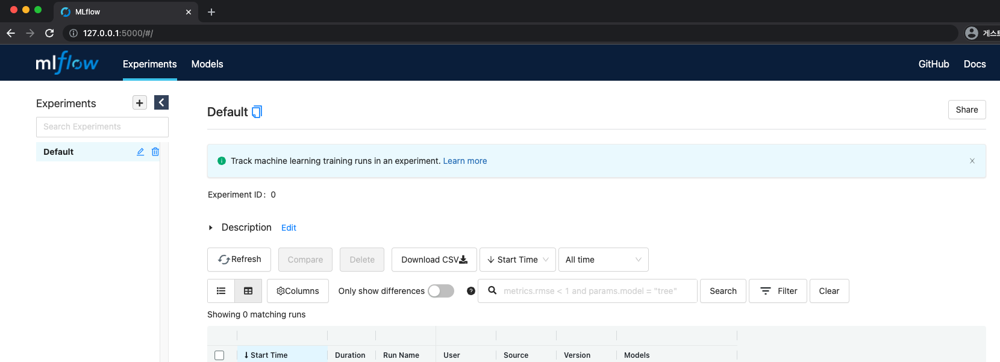

# 2. MLflow 실습 1 - 설치, tracking server

## 2.1 MLflow 설치

### 2.1.1 Prerequisite

- 터미널 사용이 가능한 OS
- Python 가상 환경
  - conda
  - mlflow models serve 할 때 필요
  - Python 3.8.5 사용 (3.6 이상)
  - pip3


### 2.1.2 설치 방법

```bash
# 실습 폴더 생성
mkdir mlflow-practice
cd mlflow-practice

# conda 가상환경 세팅
conda create --name mlflow python=3.8.5

# mlflow 설치
pip install mlflow==1.20.2
```


## 2.2 MLflow tracking server 띄워보기

### 2.2.1 tracking server 띄우는 방법 (2가지)

#### 2.2.1.1 `mlflow ui`

- mlflow tracking server를 띄운다.
- UI (dashboard)의 default url
  - `http://localhost:5000`
- `5000` 포트가 열려있는 지 확인
- production 용으로는 `mlflow ui` 대신 `mlflow server` 를 사용하라는 안내가 출력된다.
- 주요 argument
  - `-p`, `--port`
    - 포트 지정 (default: `5000`)

  - `-h`, `--host`
    -  호스트 주소 지정 (default: `127.0.0.1`)

  - `--backend-store-uri`
    -  실험(experiment) 및 실행(run) 데이터 저장 URI 지정
    - 미지정 시 `mlruns`라는 폴더를 만들어서 데이터 저장

  - `--default-artifact-root`
    - artifact를 저장할 로컬 경로 지정
    - 미지정 시 `mlruns`라는 폴더를 만들어서 데이터 저장


#### 2.2.1.2 `mlflow server`

- mlflow server는 worker를 여러 개 띄울 수 있고, prometheus가 metrics을 가져갈 수 있도록 앤드포인트를 제공하는 등의 추가적인 기능이 존재한다.
- `mlflow ui`는 `--default-artifact-root`로 로컬 파일 시스템만 사용할 수 있지만, `mlflow server`는 AWS S3와 같은 외부의 object storage를 사용할 수 있다.
- `-w`, `--workers` argument를 통해 worker 갯수를 지정하여 작업을 더 빠르게 수행할 수 있다.
- `--expose-prometheus` argument를 통해 prometheus가 metric을 pulling 해갈 수 있도록 앤드포인트를 제공할 수 있다.


### 2.2.2 `mlflow ui`로 tracking server 띄우기

```bash
mlflow ui
```

- 위 명령어를 실행한 터미널을 켜둔 상태로 `http://localhost:5000`으로 접속한다.

  - 터미널이 꺼지면 MLflow tracking server도 종료된다.

- 아래와 같은 화면이 나타나면, 정상적으로 MLflow tracking server가 생성된 것을 의미한다.

  


### 2.2.3 `mlruns`

- 다른 터미널을 열어서, 동일한 디렉토리로 이동하면 `mlruns`라는 디렉토리가 생성된 것을 확인할 수 있다.
- `mlflow ui` 실행 시 `--backend-store-uri`, `--default-artifact-root` 옵션을 주지 않은 경우, `mlflow ui`를 실행한 디렉토리에 `mlruns` 라는 디렉토리를 생성한 뒤, 이 곳에 실험 관련 데이터를 저장하게 된다.
- 이 디렉토리만 존재한다면, `mlflow ui` 터미널을 종료한 뒤, 다시 실행시켜도 동일한 화면을 볼 수 있게 된다.
