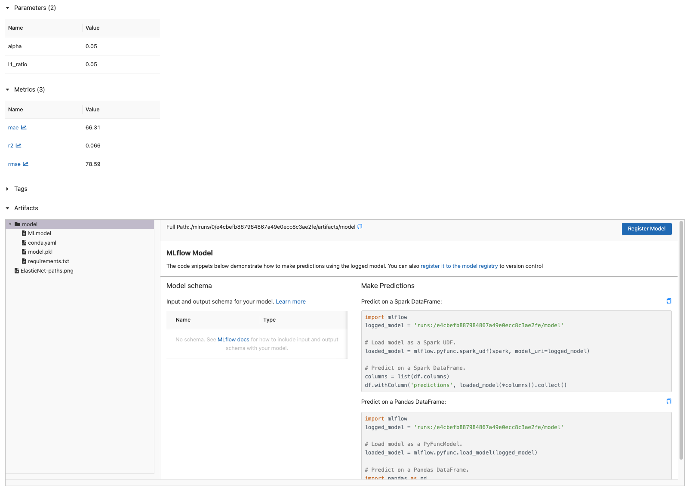
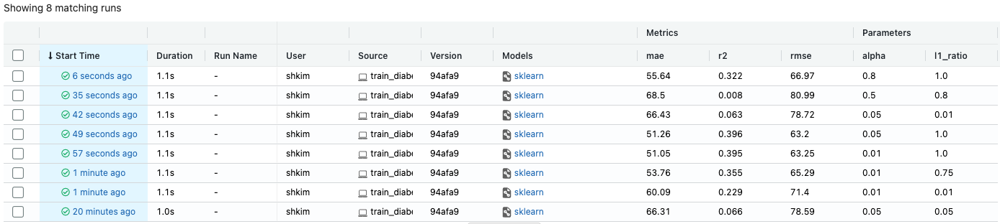
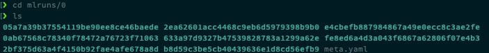
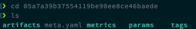

# 3. MLflow 실습 2 - Example code

## 3.1 Example code 살펴보기

- [Scikit-learn ElasticNet Diabetes Example](https://github.com/mlflow/mlflow/tree/master/examples/sklearn_elasticnet_diabetes)


### 3.1.1 다운로드

```bash
# VM 혹은 linux 사용자
wget https://raw.githubusercontent.com/mlflow/mlflow/master/examples/sklearn_elasticnet_diabetes/linux/train_diabetes.py

# Mac 사용자
wget https://raw.githubusercontent.com/mlflow/mlflow/master/examples/sklearn_elasticnet_diabetes/osx/train_diabetes.py
```


### 3.1.2 `train_diabetes.py`

- mlflow 에서 example 로 제공해주는 다양한 example 중 하나인 `train_diabetes.py`
- scikit-learn 패키지에서 제공하는 당뇨병(diabetes) 진행도 예측용 데이터로 ElasticNet 모델을 학습하여, predict 한 뒤 그 evaluation metric을 MLflow에 기록하는 예제
- 442 명의 당뇨병 환자를 대상으로, 나이, 성별, bmi 등의 10 개의 독립변수(X) 를 가지고 1년 뒤 당뇨병의 진행률 (y) 를 예측하는 문제


### 3.1.3 ElasticNet

- Linear Regression + L1 Regularization + L2 Regularization
- parameter
  - `alpha`
    - Regularization coefficient
  - `l1_ratio`
    - L1 Regularization과 L2 Regularization의 비율


### 3.1.4 코드 확인

- mlflow와 연관된 부분에 주목

  - `mlflow.log_param`

  - `mlflow.log_metric`

  - `mlflow.log_model`

  - `mlflow.log_artifact`

```python
# train_diabetes.py

#
# train_diabetes.py
#
#   MLflow model using ElasticNet (sklearn) and Plots ElasticNet Descent Paths
#
#   Uses the sklearn Diabetes dataset to predict diabetes progression using ElasticNet
#       The predicted "progression" column is a quantitative measure of disease progression one year after baseline
#       http://scikit-learn.org/stable/modules/generated/sklearn.datasets.load_diabetes.html
#   Combines the above with the Lasso Coordinate Descent Path Plot
#       http://scikit-learn.org/stable/auto_examples/linear_model/plot_lasso_coordinate_descent_path.html
#       Original author: Alexandre Gramfort <alexandre.gramfort@inria.fr>; License: BSD 3 clause
#
#  Usage:
#    python train_diabetes.py 0.01 0.01
#    python train_diabetes.py 0.01 0.75
#    python train_diabetes.py 0.01 1.0
#

import os
import warnings
import sys

import pandas as pd
import numpy as np
from itertools import cycle
import matplotlib.pyplot as plt
from sklearn.metrics import mean_squared_error, mean_absolute_error, r2_score
from sklearn.model_selection import train_test_split
from sklearn.linear_model import ElasticNet
from sklearn.linear_model import lasso_path, enet_path
from sklearn import datasets

# Load Diabetes datasets
diabetes = datasets.load_diabetes()
X = diabetes.data
y = diabetes.target

# Create pandas DataFrame for sklearn ElasticNet linear_model
Y = np.array([y]).transpose()
d = np.concatenate((X, Y), axis=1)
cols = diabetes.feature_names + ["progression"]
data = pd.DataFrame(d, columns=cols)


# Import mlflow
import mlflow
import mlflow.sklearn


# Evaluate metrics
def eval_metrics(actual, pred):
    rmse = np.sqrt(mean_squared_error(actual, pred))
    mae = mean_absolute_error(actual, pred)
    r2 = r2_score(actual, pred)
    return rmse, mae, r2


if __name__ == "__main__":
    warnings.filterwarnings("ignore")
    np.random.seed(40)

    # Split the data into training and test sets. (0.75, 0.25) split.
    train, test = train_test_split(data)

    # The predicted column is "progression" which is a quantitative measure of disease progression one year after baseline
    train_x = train.drop(["progression"], axis=1)
    test_x = test.drop(["progression"], axis=1)
    train_y = train[["progression"]]
    test_y = test[["progression"]]

    alpha = float(sys.argv[1]) if len(sys.argv) > 1 else 0.05
    l1_ratio = float(sys.argv[2]) if len(sys.argv) > 2 else 0.05

    # Run ElasticNet
    lr = ElasticNet(alpha=alpha, l1_ratio=l1_ratio, random_state=42)
    lr.fit(train_x, train_y)
    predicted_qualities = lr.predict(test_x)
    (rmse, mae, r2) = eval_metrics(test_y, predicted_qualities)

    # Print out ElasticNet model metrics
    print("Elasticnet model (alpha=%f, l1_ratio=%f):" % (alpha, l1_ratio))
    print("  RMSE: %s" % rmse)
    print("  MAE: %s" % mae)
    print("  R2: %s" % r2)

    # Log mlflow attributes for mlflow UI
    mlflow.log_param("alpha", alpha)
    mlflow.log_param("l1_ratio", l1_ratio)
    mlflow.log_metric("rmse", rmse)
    mlflow.log_metric("r2", r2)
    mlflow.log_metric("mae", mae)
    mlflow.sklearn.log_model(lr, "model")

    # Compute paths
    eps = 5e-3  # the smaller it is the longer is the path

    print("Computing regularization path using the elastic net.")
    alphas_enet, coefs_enet, _ = enet_path(X, y, eps=eps, l1_ratio=l1_ratio)

    # Display results
    fig = plt.figure(1)
    ax = plt.gca()

    colors = cycle(["b", "r", "g", "c", "k"])
    neg_log_alphas_enet = -np.log10(alphas_enet)
    for coef_e, c in zip(coefs_enet, colors):
        l2 = plt.plot(neg_log_alphas_enet, coef_e, linestyle="--", c=c)

    plt.xlabel("-Log(alpha)")
    plt.ylabel("coefficients")
    title = "ElasticNet Path by alpha for l1_ratio = " + str(l1_ratio)
    plt.title(title)
    plt.axis("tight")

    # Save figures
    fig.savefig("ElasticNet-paths.png")

    # Close plot
    plt.close(fig)

    # Log artifacts (output files)
    mlflow.log_artifact("ElasticNet-paths.png")
```


## 3.2 Example code 실행

example 코드 실행 후 mlflow에 기록되는 것 확인

```bash
python train_diabetes.py
```

- model 관련 메타 정보와 더불어 `pkl` 파일이 저장된 것을 확인

  


다양한 파라미터로 테스트 후 mlflow 확인

```bash
python train_diabetes.py  0.01 0.01
python train_diabetes.py  0.01 0.75
python train_diabetes.py  0.01 1.0
python train_diabetes.py  0.05 1.0
python train_diabetes.py  0.05 0.01
python train_diabetes.py  0.5 0.8
python train_diabetes.py  0.8 1.0
```

- 다음과 같은 화면이 출력되며, metrics와 parameter를 한 눈에 비교할 수 있다.

  


## 3.3 MLflow 데이터 저장 방식

```bash
cd mlruns/0
ls
```

<div></div>

- 굉장히 많은 디렉토리가 생성되었다.
- 각각의 폴더명은 mlflow의 `run-id`를 의미한다.


특정 디렉토리 들어가보기

```bash
cd <특정 디렉토리>
ls
```

<div></div>

- `artifacts`, `metrics`, `params`, `tags` 와 같은 디렉토리가 있고 그 안에 실제 mlflow run의 메타 정보가 저장된 것을 확인할 수 있다.


