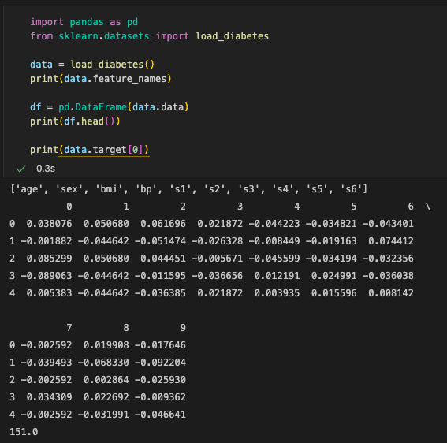
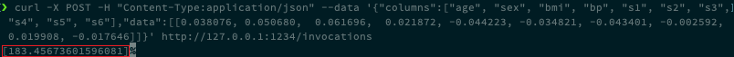
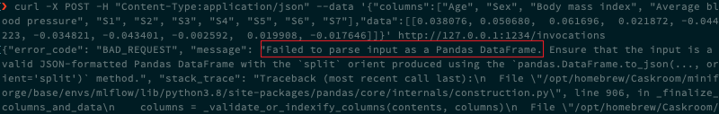

# 4. MLflow 실습 3 - Serving Example

## 4.1 MLflow를 사용한 서빙 Example

- MLflow를 사용하여 간단하게 서빙도 할 수 있다.

- [https://mlflow.org/docs/latest/tutorials-and-examples/tutorial.html](https://mlflow.org/docs/latest/tutorials-and-examples/tutorial.html)


### 4.1.1 `mlflow models serve`

```bash
mlflow models serve -m $(pwd)/mlruns/0/<run-id>/artifacts/model -p <port> --no-conda

mlflow models serve -m $(pwd)/mlruns/0/0ab67568c78340f78472a76723f71063/artifacts/model -p 1234 --no-conda
```

- 원하는 모델의 `run-id`를 확인한 다음, port를 지정하여 `mlflow models serve` 명령을 수행한다.
- 모델 서빙이라는 의미는 `127.0.0.1:1234`에서 REST API 형태로 `.predict()` 함수를 사용할 수 있는 것을 의미한다.


### 4.1.2 데이터 형식 확인

- 이제 해당 서버에 API를 보내서, `predict()`의 결과를 확인해보자.
- API를 보내기 위해서는 request body에 포함될 데이터의 형식을 알고 있어야 한다.

- diabetes 데이터의 column과 sample 데이터를 확인해보자.

  - [https://scikit-learn.org/stable/modules/generated/sklearn.datasets.load_diabetes.html](https://scikit-learn.org/stable/modules/generated/sklearn.datasets.load_diabetes.html)

  ```python
  import pandas as pd
  from sklearn.datasets import load_diabetes
  
  data = load_diabetes()
  print(data.feature_names)
  
  df = pd.DataFrame(data.data)
  print(df.head())
  
  print(data.target[0])
  ```

  <div></div>


### 4.1.3 API 요청 수행

- `127.0.0.1:1234` 서버에서 제공하는 `POST /invocations` API 요청을 수행

  ```bash
  curl -X POST -H "Content-Type:application/json" --data '{"columns":["age", "sex", "bmi", "bp", "s1", "s2", "s3", "s4", "s5", "s6"],"data":[[0.038076, 0.050680,  0.061696,  0.021872, -0.044223, -0.034821, -0.043401, -0.002592,  0.019908, -0.017646]]}' http://127.0.0.1:1234/invocations
  ```

  <div></div>

  - prediction value가 API의 response로 반환되는 것을 확인할 수 있다.


### 4.1.4 잘못된 데이터 형식의 API 요청 수행

- 정해진 데이터의 크기와 다르게 `POST /invocations` API 요청을 수행

  ```bash
  curl -X POST -H "Content-Type:application/json" --data '{"columns":["Age", "Sex", "Body mass index", "Average blood pressure", "S1", "S2", "S3", "S4", "S5", "S6", "S7"],"data":[[0.038076, 0.050680,  0.061696,  0.021872, -0.044223, -0.034821, -0.043401, -0.002592,  0.019908, -0.017646]]}' http://127.0.0.1:1234/invocations
  ```

  <div></div>

  - data size가 predict하기에는 안 맞다는 에러가 반환되는 것을 확인할 수 있다.


## 4.2 다양한 서빙 tool

- mlflow를 사용한 서빙도 가능하지만, flask, seldon-core와 같은 tool을 사용한 서빙도 가능하다.
