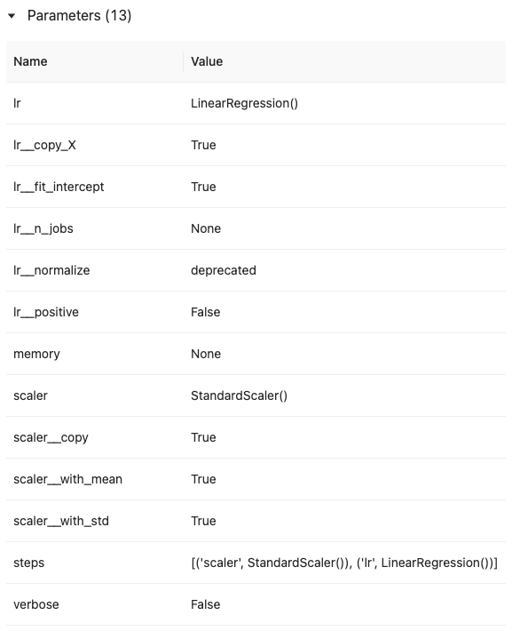
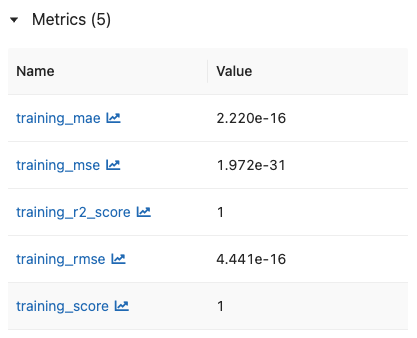
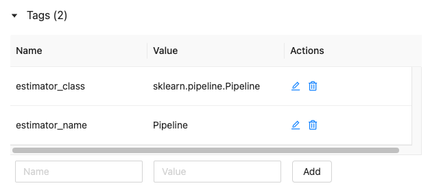
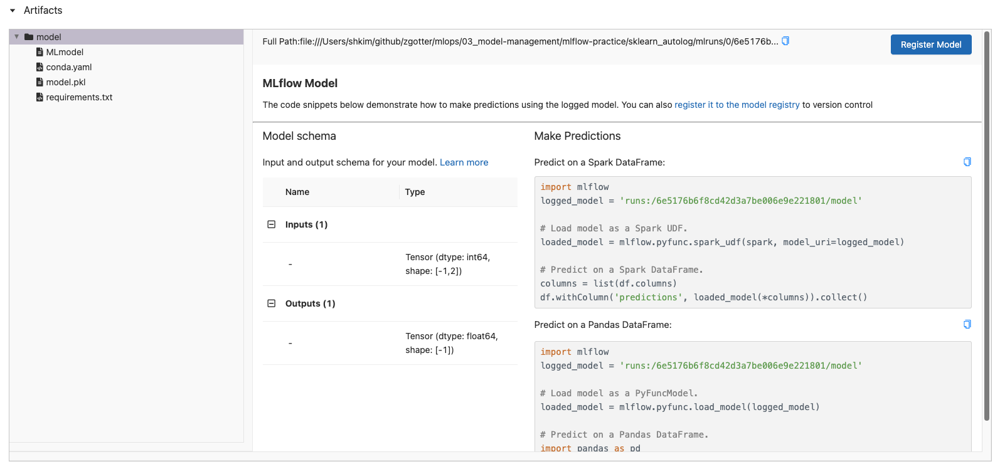
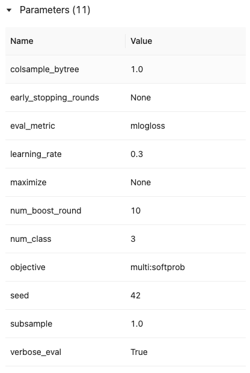
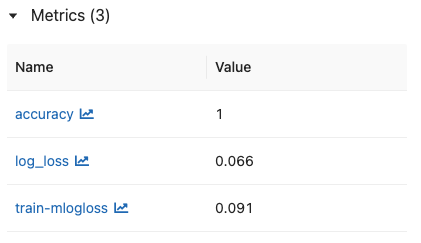
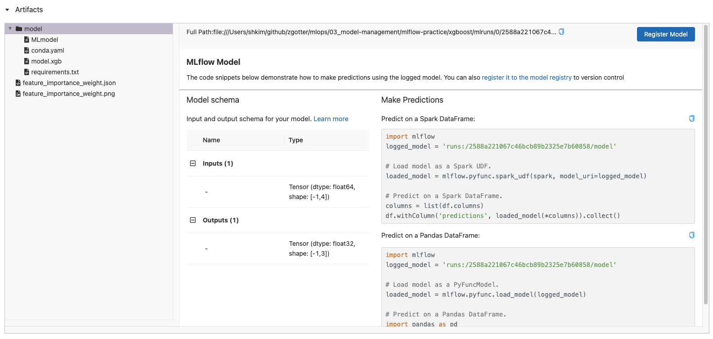

# 5. MLflow 실습 4 - Automatic Logging, XGB Model

## 5.1 Automatic Logging

### 5.1.1 Example code - sklearn_autolog

- [https://github.com/mlflow/mlflow/tree/master/examples/sklearn_autolog](https://github.com/mlflow/mlflow/tree/master/examples/sklearn_autolog)

- 간단한 학습 데이터를 가지고 `sklearn`의 `Pipeline`을 사용해, `StandardScaler` 전처리 이후 `LinearRegression`을 수행하는 example

- 필요한 파일 다운로드

  ```bash
  wget https://raw.githubusercontent.com/mlflow/mlflow/master/examples/sklearn_autolog/utils.py
  wget https://raw.githubusercontent.com/mlflow/mlflow/master/examples/sklearn_autolog/pipeline.py
  ```


### 5.1.2 `autolog`

```python
import mlflow

mlflow.sklearn.autolog()
```

- [MLflow - Automatic Logging](https://www.mlflow.org/docs/latest/tracking.html#automatic-logging)
- scimitar-learn과 같은 패키지는 mlflow 레벨에서 `autolog`를 지원한다.
- autolog란 모델의 parameter, metrics와 model artifacts를 사용자가 명시하지 않아도 자동으로 mlfow에서 로깅을 해준다.


### 5.1.3 Example code 실행

```bash
cd sklearn_autolog
python pipeline.py
```


### 5.1.4 실험 결과 확인

#### 5.1.4.1 Parameters

<div></div>


#### 5.1.4.2 Metrics

<div></div>


#### 5.1.4.3 Tags

<div></div>


#### 5.1.4.4 Artifacts

<div></div>


## 5.2 XGB Model

### 5.2.1 Example code - xgboost

- [https://github.com/mlflow/mlflow/tree/master/examples/xgboost](https://github.com/mlflow/mlflow/tree/master/examples/xgboost)

- iris 데이터를 가지고 xgboost 모델로 classification을 수행하는 코드

- mlflow에서 지원하는 xgboost용 autolog을 사용했고, 추가적인 custom metric을 남기기 위해 `mlflow.log_metrics()` 사용

- 필요한 파일 다운로드

  ```bash
  wget https://raw.githubusercontent.com/mlflow/mlflow/master/examples/xgboost/xgboost_native/train.py
  
  # xgboost==1.4.2 설치 필요
  ```


### 5.2.2 Example code 실행

```bash
cd xgboost
python train.py
```


### 5.2.3 실험 결과 확인

#### 5.2.3.1 Parameters

<div></div>


#### 5.2.3.2 Metrics

<div></div>


#### 5.2.3.3 Artifacts

<div></div>
