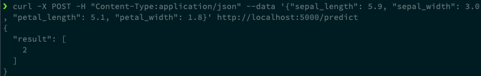

# 2. Flask

## 2.1 Flask 란

> The python micro framework for building web applications

- [https://github.com/pallets/flask](https://github.com/pallets/flask)
- Micro Service Architecture(MSA)를 위한 web app framework
  - web app framework (web framework) : 웹 서비스 개발을 위한 프레임워크
- Django 등 다른 framework에 비해 굉장히 가벼우며, 확장성, 유연성이 뛰어난 프레임워크
- 단, 자체 지원 기능은 적다는 게 장점이자 단점
- 사용하기 쉽고, 간단한 기능을 가볍게 구현하기에 적합하기 때문에 대부분의 ML Model의 첫 배포 Step으로 Flask를 자주 사용한다.


## 2.2 Flask 설치

### 2.2.1 Prerequisite

- Python 가상환경
  - 3.6 이상 (3.8.9 사용)
  - pip3


### 2.2.2 설치 방법

```bash
# 실습 폴더 생성
mkdir flask-practice
cd flask-practice

# conda 가상환경 생성
conda create --name flask python=3.8.9

# Flask 설치
pip install -U Flask==2.0.2

# Flask 버전 확인
flask --version
```


## 2.3 Hello World! with Flask

- Flask를 사용해 간단한 Web Server를 띄워보자.


### 2.3.1 `app.py` 파일 생성

```python
# app.py

from flask import Flask

app = Flask(__name__)

@app.route("/")
def hello_world():
    return "<p>Hello, World!</p>"

if __name__ == "__main__":
	app.run(debug=True, host='0.0.0.0', port=5000)
# debug 모드로 실행, 모든 IP 에서 접근 허용, 5000 포트로 사용하는 것을 의미
```


### 2.3.2 application server 실행

- 동일한 폴더에서 `python app.py` 를 수행하여 application server를 로컬에 띄운다.
- `127.0.0.1:5000` 으로 접속하면, `Hello World!` 라는 문자가 브라우저에 보이는 것을 확인할 수 있다.


## 2.4 Routing

- flask의 `route()` 데코레이터는 파이썬 함수를 web server의 URI에 맵핑시킬 수 있다.
- 이를 활용하여 원하는대로 routing을 수행할 수 있다.


### 2.4.1 Routing 예시 (`app2.py`)

```python
# app2.py

from flask import Flask

app = Flask(__name__)

@app.route("/")
def hello_world():
    return "<p>Hello World!</p>"

@app.route("/shkim")
def hello_shkim():
    return "<p>Hello shkim!</p>"

if __name__ == "__main__":
	app.run(debug=True, host='0.0.0.0', port=5000)
```

- `python app2.py` 를 수행하여 application server를 로컬에 띄운다.
- `127.0.0.1:5000`으로 접속하면 `Hello World!` 라는 문자가 보이는 것을 확인할 수 있다.
- `127.0.0.1:5000/shkim`으로 접속하면 `Hello shkim!` 라는 문자가 보이는 것을 확인할 수 있다.


## 2.5 POST Method

- flask의 `route()` 데코레이터는 URI 뿐만 아니라 HTTP Method도 지정할 수 있다.
- 이를 활용하여 원하는대로 API를 만들 수 있다.


### 2.5.1 POST Method 예시 (`app3.py`)

```python
# app3.py

from flask import Flask
import json

app = Flask(__name__)

@app.route("/predict", methods=["POST", "PUT"])
def inference():
    return json.dumps({'hello': 'world'}), 200 # http status code 를 200 으로 반환하는 것을 의미합니다.

if __name__ == "__main__":
	app.run(debug=True, host='0.0.0.0', port=5000)
```

- `python app3.py` 를 수행하여 application server를 로컬에 띄운다.


- `curl`을 수행하여 HTTP 응답을 확인한다.

  ```bash
  curl -X POST http://127.0.0.1:5000/predict
  # {"hello": "world"}
  
  curl -X PUT http://127.0.0.1:5000/predict
  # {"hello": "world"}
  
  curl -X GET http://127.0.0.1:5000/predict
  # <!DOCTYPE HTML PUBLIC "-//W3C//DTD HTML 3.2 Final//EN">
  # <title>405 Method Not Allowed</title>
  # <h1>Method Not Allowed</h1>
  # <p>The method is not allowed for the requested URL.</p>
  ```

- `POST`, `PUT` 만 허용했으므로 `POST`, `PUT` 에 대한 응답은 정상적으로 온다.

- `GET`에 대한 응답은 405 ERROR가 반환된다.


## 2.6 Flask를 이용한 머신러닝 모델 Serving

- Flask는 사용하기 쉽고, 간단한 기능을 구현하기에 적합하기 때문에 대부분의 ML Model의 첫 배포 Step으로 자주 사용하는 Framework 중 하나이다.
- iris 데이터를 사용한 간단한 classification model을 학습한 뒤, 모델을 pickle 파일로 저장하고, Flask를 사용해 해당 파일을 load하여 predict하는 server를 구현해보자.
- 그 이후, 해당 server를 run 하여 직접 http request를 요청하여 정상적으로 response가 반환되는 지 확인한다.


### 2.6.1 모델 학습 및 저장 Sample Code

```python
# train.py

import os
import pickle

from sklearn.datasets import load_iris
from sklearn.ensemble import RandomForestClassifier
from sklearn.metrics import accuracy_score, classification_report
from sklearn.model_selection import train_test_split

RANDOM_SEED = 1234

# STEP 1) data load
data = load_iris()

# STEP 2) data split
X = data['data']
y = data['target']

X_train, X_test, y_train, y_test = train_test_split(X, y, test_size=0.3,
                                                    random_state=RANDOM_SEED)

# STEP 3) train model
model = RandomForestClassifier(n_estimators=300, random_state=RANDOM_SEED)
model.fit(X_train, y_train)

# STEP 4) evaluate model
print(f"Accuracy :  {accuracy_score(y_test, model.predict(X_test))}")
print(classification_report(y_test, model.predict(X_test)))

# STEP 5) save model to ./build/model.pkl
os.makedirs("./build", exist_ok=True)
pickle.dump(model, open('./build/model.pkl', 'wb'))
```


### 2.6.2 모델 학습 및 저장

```bash
python train.py
```

<div></div>


- `build` 디렉토리 내부에 `model.pkl` 파일이 생성되는 것 확인

  ```bash
  cd build
  
  ls
  ```

  <div></div>


### 2.6.3 Flask Server 구현

- 저장한 pkl 파일을 load하여, POST /predict API를 제공하는 Flask Server를 구현한다.

```python
# flask_server.py

import pickle

import numpy as np
from flask import Flask, jsonify, request

# 지난 시간에 학습한 모델 파일을 불러옵니다.
model = pickle.load(open('./build/model.pkl', 'rb'))

# Flask Server 를 구현합니다.
app = Flask(__name__)


# POST /predict 라는 API 를 구현합니다.
@app.route('/predict', methods=['POST'])
def make_predict():
    # API Request Body 를 python dictionary object 로 변환합니다.
    request_body = request.get_json(force=True)

    # request body 를 model 의 형식에 맞게 변환합니다.
    X_test = [request_body['sepal_length'], request_body['sepal_width'],
              request_body['petal_length'], request_body['petal_width']]
    X_test = np.array(X_test)
    X_test = X_test.reshape(1, -1)

    # model 의 predict 함수를 호출하여, prediction 값을 구합니다.
    y_test = model.predict(X_test)

    # prediction 값을 json 화합니다.
    response_body = jsonify(result=y_test.tolist())

    # predict 결과를 담아 API Response Body 를 return 합니다.
    return response_body


if __name__ == '__main__':
    app.run(port=5000, debug=True)
```


### 2.6.4 API 테스트

- Flask server run

  ```bash
  python flask_server.py
  ```

- 다음과 같은 메세지가 출력되면 정상적으로 Flask server가 동작하는 것을 의미한다.

  <div></div>

  - `http://127.0.0.1:5000/` 가 flask server의 주소를 의미한다.


- 해당 Flask server에 `POST /predict` API를 요청하여, 어떤 결과가 반환되는 지 확인한다.

  ```bash
  curl -X POST -H "Content-Type:application/json" --data '{"sepal_length": 5.9, "sepal_width": 3.0, "petal_length": 5.1, "petal_width": 1.8}' http://localhost:5000/predict
  ```

  <div></div>

  - 0, 1, 2 중 하나의 type으로 classification 하게 된다.


