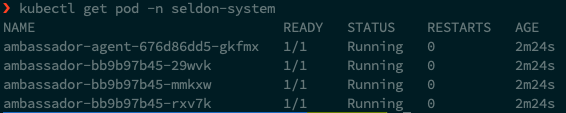
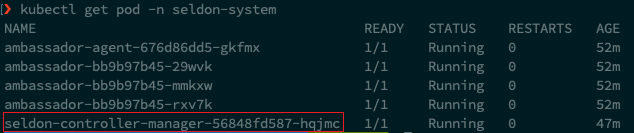
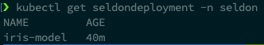
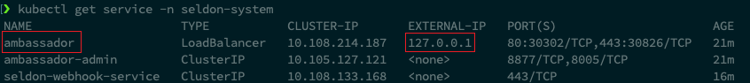
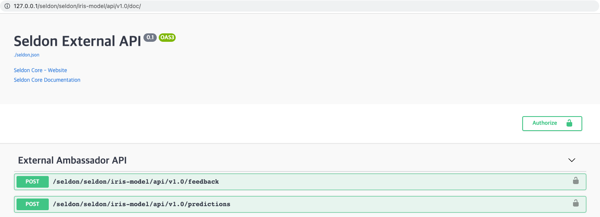
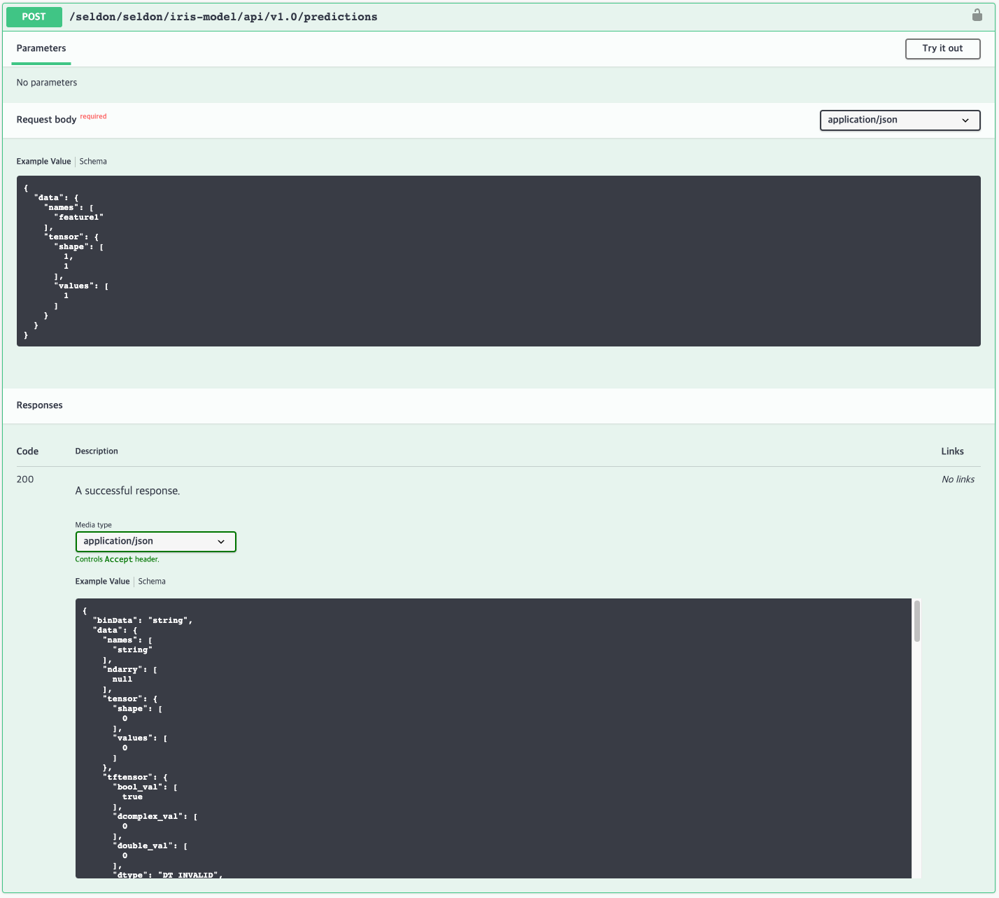
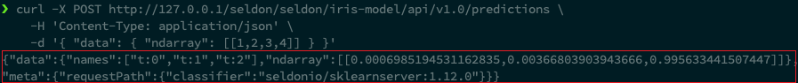
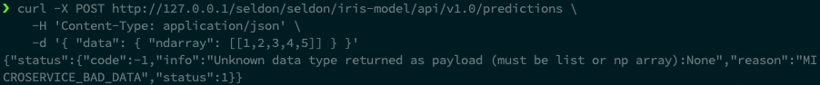
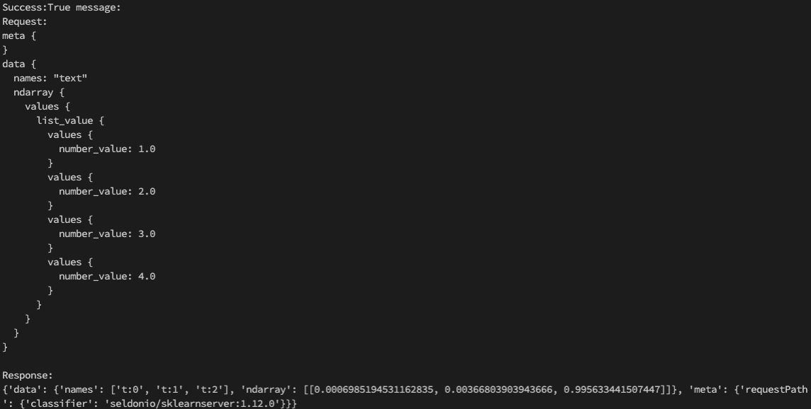

# 3. Seldon core

## 3.1 Prerequisite 개념 정리

### 3.1.1 Custom Resource

- [쿠버네티스 Custom Resource 공식 문서](https://kubernetes.io/ko/docs/concepts/extend-kubernetes/api-extension/custom-resources/)
- **Custom Resource(CR)은 쿠버네티스 API의 확장판**이다.
- 쿠버네티스에서 기본적으로 관리하는 리소스들에는 Pod, Deployment, Service, PersistentVolume(PV) 등이 있다.
- 하지만 유저가 직접 정의한 리소스를 쿠버네티스의 API를 사용해서 관리하고 싶은 경우에는 Custom Resource와 해당 CR의 LifeCycle과 동작을 관리할 Controller(혹은 API Server)를 구현한 후 쿠버네티스 클러스터에 배포해야 한다.
  - CR을 클러스터에 등록하는 방법은 2가지가 있다.
    - Custom Resource Definition (CRD) 방식
    - API Aggregation (AA) 방식
  - CRD 방식은 CR을 관리할 Custom Controller를 구현하고 배포하여 사용한다.
  - Controller는 대부분 Operation pattern으로 개발된다.
- 쿠버네티스에서 default로 관리하지는 않지만, 배포된 Custom Controller에 의해 쿠버네티스에서 관리되고 있는 리소스들을 Custom Resource라고 한다.


### 3.1.2 Operation pattern

- [쿠버네티스 operator pattern 공식 문서](https://kubernetes.io/ko/docs/concepts/extend-kubernetes/operator/)
- Controller
  - Desired State와 Current State를 주기적으로 비교하여, **Current State를 Desired State에 일치시키도록 지속적으로 동작**하는 무한 루프
  - [쿠버네티스 controller 공식 문서]()

- Operator

  - **Controller pattern을 사용하여 사용자의 애플리케이션을 자동화**하는 것
  - 주로 CR의 Current/Desired State를 지속적으로 관찰하고 일치시키도록 동작하는 역할을 위해 사용됨

- Operator 개발 방법

  - Operator 개발에 필요한 부수적인 작업이 자동화되어 있는 Framework를 활용하여 개발
    - [kubebuilder](https://book.kubebuilder.io/)
    - [KUDO](https://kudo.dev/)
    - [Operator SDK](https://sdk.operatorframework.io/)

  - seldon-core, prometheus, grafana, kubeflow, katib을 포함해 쿠버네티스 생태계에서 동작하는 많은 모듈들이 이러한 Operator로 개발되어 있다.


### 3.1.3 Helm

- [Helm 공식 문서](https://helm.sh/docs/)
- **쿠버네티스 모듈의 Package Managing Tool**
  - Ubuntu OS의 패키지 관리 도구 `apt`, Mac OS의 패키지 관리 도구 `brew`, Python 패키지 관리 도구 `pip`와 비슷한 역할
- 하나의 쿠버네티스 모듈은 다수의 리소스들을 포함하고 있는 경우가 많다.
  - `a.yaml`, `b.yaml`, `c.yaml` 등
- 수많은 쿠버네티스 리소스 파일들을 관리해야 하기 때문에 버전 관리, 환경별 리소스 파일 관리 등이 어렵다.
- Helm은 이러한 작업을 탬플릿화시켜서 많은 수의 리소스들을 마치 하나의 리소스처럼 관리할 수 있게 도와주는 도구이다.
- Helm manifest는 크게 `templates`와 `values.yaml`로 이루어져 있다.
  - `templates` 폴더에는 해당 모듈에서 관리하는 모든 쿠버네티스 리소스들의 탬플릿 파일이 보관된다.
  - `values.yaml` 이라는 인터페이스로부터 사용자에게 값을 입력받아 `templates` 의 정보와 merge하여 배포된다.


## 3.2 Seldon Core 설치

- [Seldon Core 설치 공식 문서](https://docs.seldon.io/projects/seldon-core/en/latest/workflow/install.html)


### 3.2.0 Prerequisite

- 쿠버네티스 환경 (v1.18 이상)
  - minikube
  - kubectl
- Helm 3
- Ingress Controller (reverse proxy module)
  - Ambassador
- Python 환경
  - python 3.6 이상
  - pip3


### 3.2.1 minikube

```bash
minikube start --driver=docker --cpus='4' --memory='4g' --kubernetes-version=v1.21.2
```

- kubernetes v1.22.0 이상부터 `v1beta1`이 더이상 지원되지 않기 때문에 실습을 위해선 `--kubernetes-version=v1.21.2`를 지정해줘야 한다.


### 3.2.2 helm

- helm version v3.5.4

- [https://github.com/helm/helm/releases](https://github.com/helm/helm/releases) 에서 링크 확인

```bash
curl -O https://get.helm.sh/helm-v3.6.3-darwin-arm64.tar.gz

# 압축 풀기
tar -zxvf helm-v3.6.3-darwin-arm64.tar.gz

# 바이너리 PATH로 이동
sudo mv darwin-arm64/helm /usr/local/bin/helm

# helm 정상 동작 확인
helm help
```


### 3.2.3 ambassador

- chart version
  - ambassador-6.9.1

```bash
# ambassador를 install하기 위해 public 하게 저장뙨 helm repository 를 등록
helm repo add datawire https://www.getambassador.io

# helm repo update
helm repo update

# helm install ambassador with com configuration
helm install ambassador datawire/ambassador \
  --namespace seldon-system \
  --create-namespace \
  --set image.repository=docker.io/datawire/ambassador \
  --set enableAES=false \
  --set crds.keep=false

# 정상 설치 확인
kubectl get pod -n seldon-system -w
kubectl get pod -n seldon-system
```

- `ambassador` : helm application name
- `datawire/ambassador` : chart info
- `--set image.repository=docker.io/datawire/ambassador --set enableAES=false --set crds.keep=false`
  - helm의 `values.yaml` 에서 제공하는 변수들의 값을 동적으로 입력

<div></div>


### 3.2.4 Seldon-core-operator

- chart version
  - seldon-core-operator-1.11.0

```bash
helm install seldon-core seldon-core-operator \
    --repo https://storage.googleapis.com/seldon-charts \
    --namespace seldon-system \
    --create-namespace \
    --set usageMetrics.enabled=true \
    --set ambassador.enabled=true

# 정상 설치 확인
kubectl get pod -n seldon-system
```

<div></div>


## 3.3 SeldonDeployment 실습

### 3.3.1 SeldonDeployment

- Seldon-Core에서 정의한 Custom Resource 중 하나

- 이미 학습이 완료된 모델을 로드해서 Serving하는 Server를 쿠버네티스에서는 SeldonDeployment라고 부르고 관리할 수 있다.
- Flask를 사용하는 경우 다음과 같은 작업들이 필요하다.
  - API 정의
  - IP, PORT 정의
  - API 문서 작성
  - 쿠버네티스에 배포하기 위해 필요한 docker build, push, pod yaml 작성 후 배포
- SeldonDeployment를 사용하면 위와 같은 작업을 할 필요없이, trained model 파일이 저장된 경로만 전달하면 자동화된 것을 볼 수 있다.


### 3.3.2 실습 절차

- Sample Seldon Deployment 생성
- 생성된 SeldonDeployment 서버가 제공하는 URI로 HTTP Request를 호출하여 정상적으로 응답이 오는 지 확인


### 3.3.3 Seldon Deployment 생성

#### 3.3.3.1 namespace 생성

- Seldon Deployment를 생성할 용도의 namespace 생성

```bash
kubectl create namespace seldon
```


#### 3.3.3.2 SeldonDeployment YAML 파일 생성

```yaml
# sample.yaml

apiVersion: machinelearning.seldon.io/v1
kind: SeldonDeployment
metadata:
  name: iris-model
  namespace: seldon
spec:
  name: iris
  predictors:
  - graph:
      implementation: SKLEARN_SERVER # seldon core에서 sklearn용으로 pre-package된 model server
      modelUri: gs://seldon-models/v1.11.0-dev/sklearn/iris # seldon core에서 제공하는 open source model (iris 데이터를 분류하는 모델이 저장된 위치, google storage에 이미 trained model이 저장되어 있음)
      name: classifier
    name: default
    replicas: 1 # 로드밸런싱을 위한 replica 개수 (replica 끼리는 자동으로 동일한 uri 공유)
```


#### 3.3.3.3 SeldonDeployment 생성

```bash
kubectl apply -f sample.yaml
```

```bash
# 생성 확인
kubectl get seldondeployment -n seldon
```

<div></div>


### 3.3.4 minikube tunnel

- 새로운 터미널을 열어 다음 명령어 수행

  ```bash
  minikube tunnel
  ```

- minikube tunnel이 열려 있으면 minikube cluster 내부와 통신할 수 있게 된다.

- ambassador와 같은 loadbalancer service를 expose하여 clusterIP를 externalIP처럼 사용하기 위한 용도로 활용된다.


### 3.3.5 ambassador external IP 확인

```bash
kubectl get service -n seldon-system
```

<div></div>

- `ambassador`의 `EXTERNAL IP` 확인


### 3.3.6 API 문서 확인

- Seldon Deployment를 생성하면 다음 주소에서 API Reference를 확인할 수 있다.

```
http://<ingress_url>/seldon/<namespace>/<model-name>/api/v1.0/doc/

http://127.0.0.1/seldon/seldon/iris-model/api/v1.0/doc/
```

- 해당 문서에는 해당 SeldonDeployment에서 지원하는 API와 해당 API의 사용법에 대한 예시가 포함되어 있다.

<div></div>

<div></div>


### 3.3.7 API Request

#### 3.3.7.1 올바른 데이터 형식의 API 요청

```bash
# curl -X POST http://<ingress>/seldon/seldon/iris-model/api/v1.0/predictions
curl -X POST http://127.0.0.1/seldon/seldon/iris-model/api/v1.0/predictions \
    -H 'Content-Type: application/json' \
    -d '{ "data": { "ndarray": [[1,2,3,4]] } }'
```

<div></div>

- multi-class classification에서 type 2일 확률이 가장 높다는 결과를 return함을 확인할 수 있다.


#### 3.3.7.2 잘못된 데이터 형식의 API 요청

```bash
curl -X POST http://127.0.0.1/seldon/seldon/iris-model/api/v1.0/predictions \
    -H 'Content-Type: application/json' \
    -d '{ "data": { "ndarray": [[1,2,3,4,5]] } }'
```

<div></div>


#### 3.3.7.3 파이썬 코드를 통한 API 요청

```bash
# conda 가상환경 생성
conda create --name seldon-core

# pypi 패키지 설치
pip install numpy,seldon-core
```

```python
# test.py

import numpy as np

from seldon_core.seldon_client import SeldonClient

sc = SeldonClient(
    gateway="ambassador",
    transport="rest",
    gateway_endpoint="127.0.0.1:80",  # Make sure you use the port above
    namespace="seldon",
)

client_prediction = sc.predict(
    data=np.array([[1, 2, 3, 4]]),
    deployment_name="iris-model",
    names=["text"],
    payload_type="ndarray",
)

print(client_prediction)
```

```bash
# 파이썬 파일 실행
python test.py
```

<div></div>


