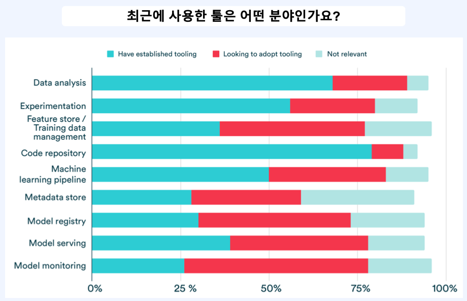
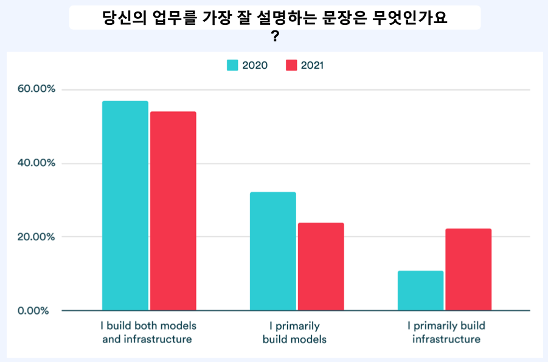
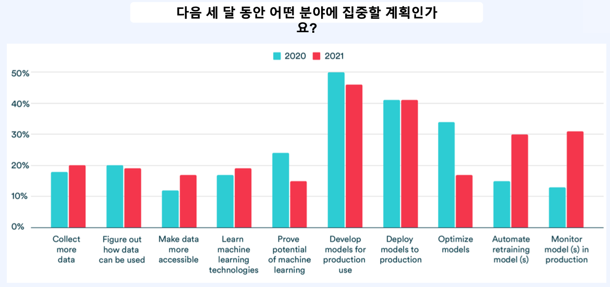

# 1. Model Monitoring 이란

## 1.1 Why Monitoring?

- 비트코인 가격 예측 모델 배포
- 가만히 놔둘 수 있을까..?

## 1.2 Possible Issues

- Inference Server가 다운되는 경우
- 거래소 서버가 터지는 경우
- 전쟁이 나는 경우
- 미 연준이 테이퍼링을 발표한 경우

- 위와 같은 상황 때문에 모델의 학습 데이터의 패턴이 달라질 수 있다.
- 모델 배포 후 안정적인 서비스 제공을 위해 지속적인 모니터링을 할 수 있는 시스템과 모니터링 결과 데이터를 바탕으로 자동화된 재학습, 재배포 파이프라인을 구축해야 한다.

## 1.3 State of MLOps 2021

- 모델 모니터링에 대한 관심과 중요도가 높은 것을 볼 수 있다.

- Data analysis 같은 경우 잘 구축된 tool들을 사용하고 있다.

- Model monitoring의 경우 더 좋은 tool을 찾아나가는 단계이다.

- 2020년에는 모델과 인프라를 개발하는 것을 더 우선시 했지만 2021년에는 인프라를 우선시하는 것을 확인할 수 있다.

- 2020년에 비해 2021년에 더 많은 비중을 차지하는 것은 "모델 재학습 자동화"와 "모델 모니터링"이다.

## 1.4 모니터링 대상

- ML 기반 서비스가 잘 돌아가고 있는 지 모니터링해야 할 것들은 무엇이 있을까?-

- 2017년 구글에서 발표한 다음 논문을 통해 확인할 수 있다.

> The ML Test Score: A Rubric for ML Production Readiness and Technical Debt Reduction, IEEE, Google

- Monitor 1
  - Dependency changes result in notification
- Monitor 2
  - Data invariants hold in training and serving inputs
- Monitor 3
  - Training and serving features compute the same values
- Monitor 4
  - Models are not too stale
- Monitor 5
  - The model is numerically stable
- Monitor 6
  - The model has not experienced dramatic or slow-leak regressions in training speed, serving latency, throughput, or RAM usage
- Monitor 7
  - The model has not experienced a regression in prediction quality on served data

## 1.5 모니터링 대상이 되는 서비스 제공 방식

### 1.5.1 ML 관련

- Input Data Distribution
- Feature Distribution
- Output Data Distribution
- Performance (Evaluation)
- Model Stability

### 1.5.2 Ops 관련

- Request Latency
- Request Error Rate
- CPU, Memory Utilization
- Disk I/O
- Network Traffic

## 1.6 모니터링 이후 해야 할 것들

- 모니터링하면서 발생한 데이터에 정상적이지 않은 이슈상황이 발생한다면 장단기적으로 해당 이슈를 해결해야 모니터링의 의미가 있다.
- 모니터링 과정에서 발견한 이슈를 해결하는 데 필요한 요소들
  - 장애가 발생한 것을 알려주는 알람 로직
  - 로그 및 트레이스 기록
  - 이슈 해결 후 배포한 다음 정상적으로 동작하는 지 확인하기 위한 end-to-end 테스트 자동화
  - health check api
  - 잘 구축된 validation set과 metric을 바탕으로 한 벤치마크 정의

## 1.7 ML 서비스 모니터링이 어려운 이유

- 전통적인 소프트웨어와 ML 기반 서비스는 성능 평가를 위한 정량적인 metric을 정의하기 어렵다.
- 

## 1.8 모니터링을 위한 오픈소스

- Prometheus
- Grafana
- Grafana loki
- Thanos

- 단순히 어떤 tool을 사용하는 것이 중요한 문제가 아니라 어떤 문제를 해결할 것이고, 어떤 요구사항이 있으며 이해관계자가 어떤 상황을 중요하게 여길 것이냐에 따라서 모니터링해야 할 요소들과 모니터링 시스템의 형태도 달라진다.

