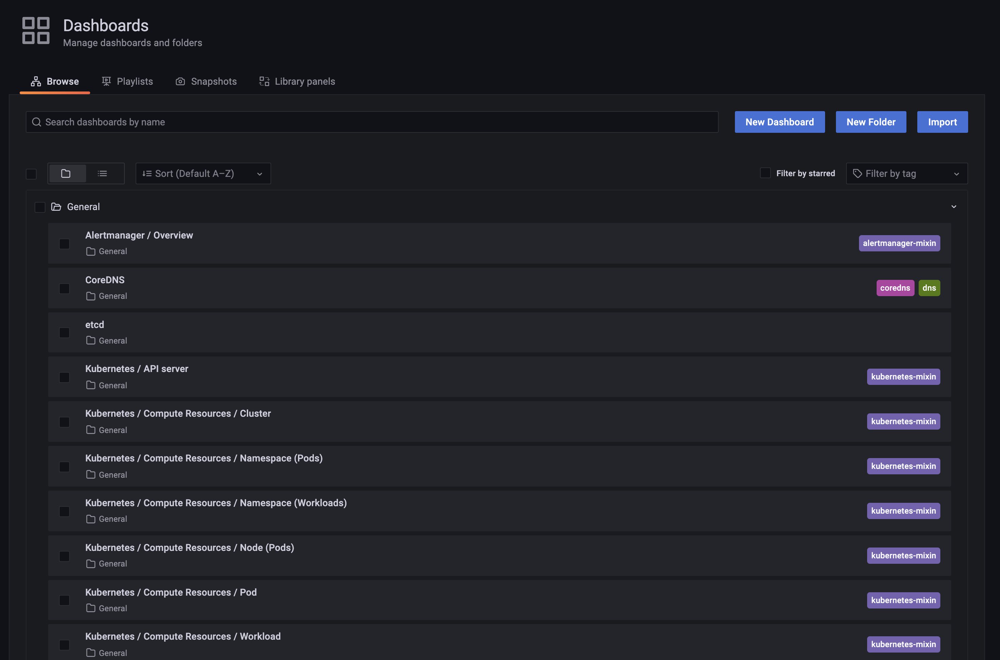

# 3. Prometheus & Grafana 실습

## 3.1 Prerequisites

- k8s 환경
  - minikube v1.22.0
- helm binary
  - helm v3


## 3.2 Install

### 3.2.1 minikube

```bash
minikube start --driver=docker --cpus='4' --memory='4g'
```


### 3.2.2 kube-prometheus-stack Helm Repo 추가

- [https://github.com/prometheus-community/helm-charts/tree/main/charts/kube-prometheus-stack](https://github.com/prometheus-community/helm-charts/tree/main/charts/kube-prometheus-stack)
- Prometheus, Grafana 등을 k8s에 쉽게 설치하고 사용할 수 있도록 패키징된 Helm 차트
- version
  - kibe-prometheus-stack-19.0.2

```bash
# helm repo 추가
helm repo add prometheus-community https://prometheus-community.github.io/helm-charts

# helm repo update
helm repo update
```


### 3.2.3 kube-prometheus-stack 설치

```bash
# helm install [RELEASE_NAME] prometheus-community/kube-prometheus-stack
helm install prom-stack prometheus-community/kube-prometheus-stack
```

- 모든 `values`는 default로 생성됨
  - [https://github.com/prometheus-community/helm-charts/blob/main/charts/kube-prometheus-stack/values.yaml](https://github.com/prometheus-community/helm-charts/blob/main/charts/kube-prometheus-stack/values.yaml)

```bash
# 정상 설치 확인
# 최초 설치 시 docker image pull로 인해 시간이 소요됨
kubectl get pod -w
```

<div></div>

- 실무에서 admin password, storage class, resource, ingress 등의 value를 수정한 뒤 적용하는 경우, charts를 clone 한 뒤, `values.yaml`을 수정하여 git으로 환경별 히스토리를 관리한다.


## 3.3 How to Use

### 3.3.1 포트 포워딩

- 새로운 터미널을 열어 포트 포워딩

```bash
# Grafana 서비스
kubectl port-forward svc/prom-stack-grafana 9000:80
```

```bash
# Prometheus 서비스
kubectl port-forward svc/prom-stack-kube-prometheus-prometheus 9091:9090
```


### 3.3.2 Prometheus UI Login

- `http://localhost:9091` 로 접속
- 다양한 PromQL 사용 가능 (Autocomplete 기능 제공)

<div></div>


#### 3.3.2.1 `kube_pod_container_status_running`

- running status 인 pod 출력

<div></div>

<div></div>


#### 3.3.2.2 `container_memory_usage_bytes`

- container 별 memory 사용 현황 출력

<div></div>

<div></div>


#### 3.3.2.3 AlertRule

<div></div>

- 다양한 AlertRule이 default로 생성되어 있음

  - expression이 PromQL을 기반으로 정의되어 있음

    <div></div>

- 해당 AlertRule이 발생하면 어디로 어떤 메세지를 보낼 것인지도 정의할 수 있음

  - message send 설정은 default로 설정하지 않은 상태

  - alertmanager configuration을 수정하여 설정할 수 있음

  - [https://github.com/prometheus-community/helm-charts/blob/7c5771add4ef2e92f520158078f8ea842c626337/charts/kube-prometheus-stack/values.yaml#L167](https://github.com/prometheus-community/helm-charts/blob/7c5771add4ef2e92f520158078f8ea842c626337/charts/kube-prometheus-stack/values.yaml#L167)

    <div></div>


### 3.3.3 Grafana UI Login

- `http://localhost:9000` 으로 접속

- default 접속 정보

  - ID : admin

  - PW : prom-operator

  - default ID 확인

    ```bash
    kubectl get secret --namespace default prom-stack-grafana -o jsonpath="{.data.admin-user}" | base64 --decode ; echo
    ```

  - default Password 확인

    ```bash
    kubectl get secret --namespace default prom-stack-grafana -o jsonpath="{.data.admin-password}" | base64 --decode ; echo
    ```

<div></div>


<div></div>


#### 3.3.3.1 Data Source

- Configuration > Data sources 탭 클릭

<div></div>


- Prometheus가 default로 등록되어 있음
  - Prometheus와 통신하는 URL은 쿠버네티스 service의 DNS로 세팅
    - Grafana와 Prometheus 모두 쿠버네티스 내부에서 통신

<div></div>


#### 3.3.3.2 Dashboards

- Dashboards > Browsse 탭 클릭

<div></div>


- 다양한 대시보드가 default로 등록되어 있음

<div></div>


- `Kubernetes/Compute Resources/Namespace(Pods)`

<div></div>

- Time Range 조절 가능
- Panel 별 PromQL 구성 확인 가능


- 우측 상단의 Add Panel 버튼
  - Panel 추가 및 수정 가능

<div></div>


- 우측 상단의 Save dashboard 버튼
  - 생성 및 수정한 Dashboard를 영구히 저장하고 공유 가능

<div></div>


- Dashboard 등록
  - Upload JSON file
  - Import from grafana.com

<div></div>

<div></div>
