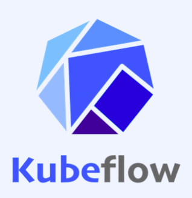
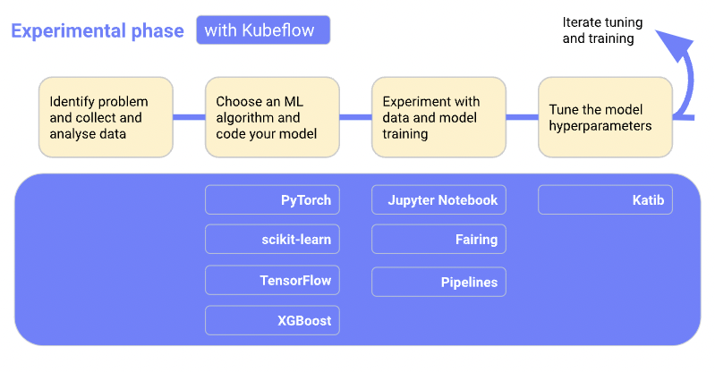
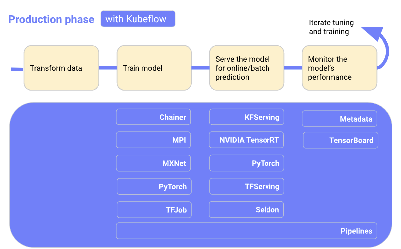
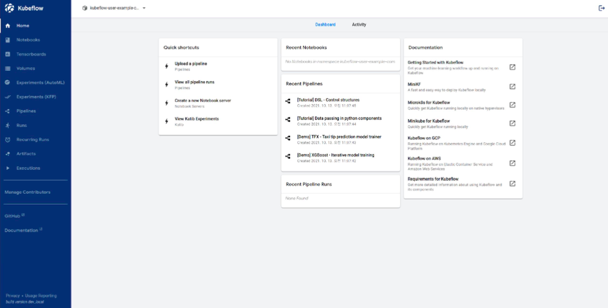
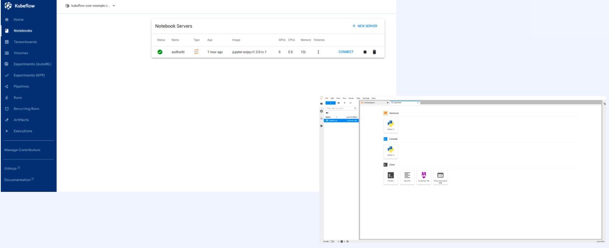
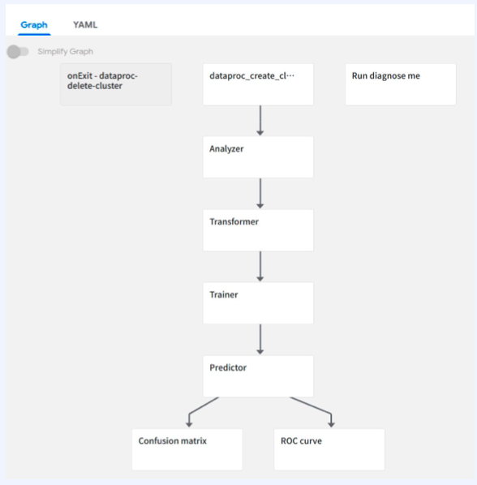
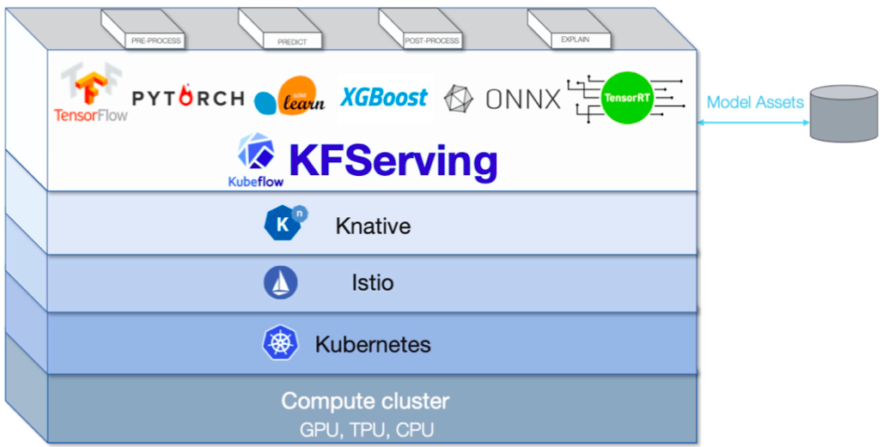
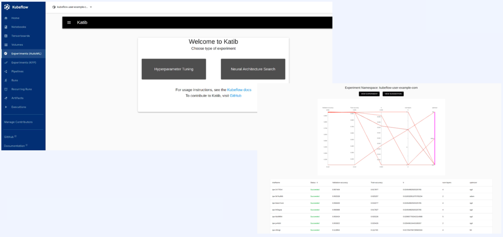
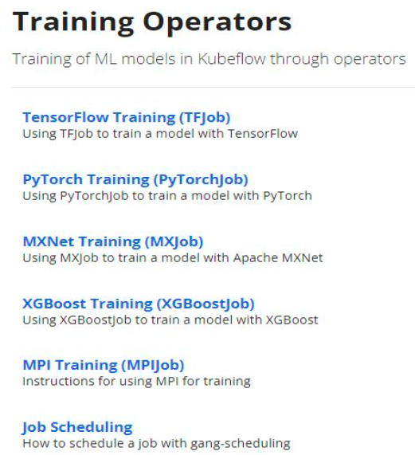
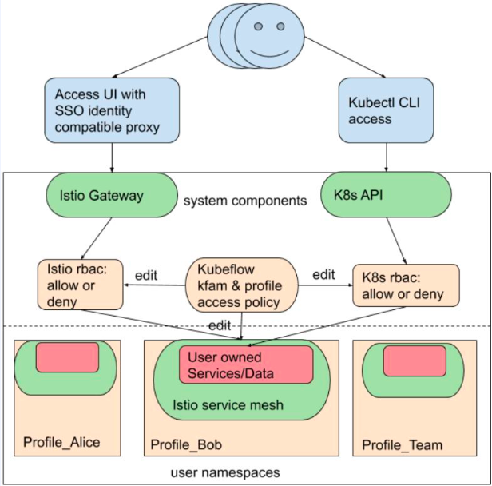

# 1. Kubeflow 란

## 1.1 쿠버네티스 복습

- MLOps를 위해서는 다음과 같은 기능들이 필요하고, 쿠버네티스가 이것들을 가능하게 해준다.

  - Reproducibility
    - 실행 환경의 일관성 & 독립성

  - Job Scheduling

    - 스케줄 관리

    - 병렬 작업 관리

    - 유휴 자원 관리

  - Auto-healing & Auto-scaling

    - 장애 대응
    - 트래픽 대응

- 위와 같은 기능들을 가능하게 하는 건 컨테이너 기반의 자원 격리가 바탕이 되어야 한다.
- 쿠버네티스는 수많은 도커 컨테이너들을 사용자 및 서버의 요구사항에 따라서 관리할 수 있다.
  - ex) 여러 사용자가 특정 시간대에 GPU 서버를 동시에 사용할 경우
    - 스케쥴링을 쿠버네티스의 자원 관리 기법을 활용할 수 있다.
    - Worker Queue에 작업을 던져놓기만 하면 자원이 사용 가능할 때 해당 코드가 실행되고, 작업 완료 후 slack, e-mail 등을 통해 noti를 줄 수 있다.
    - 작업이 실패한 경우 자동으로 재실행하는 기능도 활용할 수 있다.
  - ex) 모델 학습 시에만 GPU 서버를 사용하고, 전처리와 같은 GPU 서버가 필요하지 않는 작업에 대해서는 GPU 서버를 동적으로 할당하여 관리할 수 있다.
- 하지만, 쿠버네티스는 그 기술 자체만으로 진입 장벽이 있다.
- 쿠버네티스에 익숙하지 않은 사람이 ML Training이나 Serving을 쿠버네티스를 활용하여 할 수 있도록 해주는 것이 구글에서 개발한 Kubeflow이다.

​	

## 1.2 Kubeflow

- 2017년 KubeCon USA에서 첫 발표
- 2018년 Kubeflow v0.1 릴리즈
- 2020년 Kubeflow v1.0 릴리즈

> Kubeflow 1.0 - Cloud Native ML for Everyone

> Kubeflow is an open, community driven project to make it easy to deploy and manage an ML stack on Kubernetes

- https://github.com/kubeflow
- https://www.kubeflow.org/docs/about/community/
- Github, Slack, Mailing List, Community Call

- Kubeflow : Machine Learning Toolkit for Kubernetes

## 1.3 Kubeflow의 구성 요소

- Kubeflow는 MSA 구조로 개발되었기 때문에 각 역할마다 모듈을 쪼개서 개발되고 있다.

### 1.3.1 ML Project Workflow (Experimental, Production)

- Kubeflow에서 정의한 ML Project의 Workflow는 다음과 같다.

- Experimental phase
  - 문제 정의 및 데이터 수집 및 분석
  - ML 모델 연구 및 구현
  - 데이터를 통한 실험 및 모델 학습
  - 모델 및 하이퍼파라미터 튜닝
  - 모델 퍼포먼스 확인 후 위 과정 반복

- Production phase
  - 데이터 전처리 및 전송
  - 모델 학습
  - 모델 서빙 및 온라인/배치 예측
  - 모델의 퍼포먼스 모니터링

### 1.3.2 Micro Service

- 각각의 단계를 위해서 kubeflow에선 여러 개로 분리된 micro service들을 지원한다.

- 모델 구현 단계
  - PyTorch, scikit-learn, TensorFlow, XGBoost 와 같은 파이썬 패키지들을 쿠버네티스 환경 위에서 쉽게 돌릴 수 있도록 해준다.
- 모델 실험 단계
  - Jupyter Notebook을 동적으로 생성
  - Fairing과 Pipelines를 통해서 모델 학습 패키징
- 하이퍼파라미터 튜닝 단계
  - Katib라는 모듈을 통해 쿠버네티스 위에서 Optuna 등의 하이퍼파라미터 튜닝을 위한 파이썬 패키지를 쿠버네티스 위에서 돌릴 수 있게 해줌

- 모델 학습 과정에서 다양한 ML 패키지들을 쿠버네티스의 Job 형태로 사용할 수 있게 해준다.

- 모델 서빙 단계
  - KFServing, TFServing, Seldon core와 같은 외부 서빙 프레임워크를 쉽게 쿠버네티스와 연동할 수 있게 해주는 기능을 갖고 있다.
- 모델 모니터링 단계
  - TensorBoard 를 쿠버네티스 위에서 사용할 수 있게 해줌
- Pipelines에서 시각화 뿐만 아니라, 관련 컴포넌트들의 로그를 한번에 모아서 볼 수 있게 해준다.
- 학습 결과인 artifact들을 외부 스토리지에 저장할 수 있는 기능도 제공한다.

## 1.4 Kubeflow의 구성 요소 (상세)

### 1.4.1 Central Dashboard

- [https://github.com/kubeflow/kubeflow/tree/master/components/centraldashboard](https://github.com/kubeflow/kubeflow/tree/master/components/centraldashboard)

- 각각의 웹 브라우저를 통해서 마이크로 서비스들에 접속할 수 있는 통합 대시보드
- 왼쪽의 탭들이 각각의 마이크로 서비스
- UI로 Kubeflow의 기능을 사용하기 위해서는 항상 Central Dashboard 페이지를 통해서 접속한다.
- UI를 통해 kubeflow 관련 리소스들을 관리 및 제어할 수 있다.

### 1.4.2 Notebook Server

- [https://github.com/kubeflow/kubeflow/tree/master/components/notebook-controller](https://github.com/kubeflow/kubeflow/tree/master/components/notebook-controller)
- [https://github.com/kubeflow/kubeflow/tree/master/components/crud-web-apps/jupyter](https://github.com/kubeflow/kubeflow/tree/master/components/crud-web-apps/jupyter)

- kubeflow에서는 주피터 노트북 환경도 쿠버네티스 위에서 사용할 수 있도록 한다.
- 사용자별 namespace를 부여받은 상태에서 자신의 namespace에 여러 개의 노트북 서버를 띄울 수도 있고, 특정 노트북 서버를 vscode와 같은 IDE에 연결해서 사용할 수도 있다.
- 노트북 서버를 띄울 때, CPU, 메모리, GPU 등의 리소스의 사용량을 쿠버네티스 클러스터가 지원하는 범위 내에서 지정할 수 있다.
- 쿠버네티스 클러스터의 리소스가 부족할 경우에는 리소스 부족으로 인해 노트북 서버의 생성이 pending 되고 있다는 메세지를 확인할 수 있다.
- 주의할 점으로 kubeflow를 사용하여 띄운 노트북 서버는 쿠버네티스 입장에서는 Pod, 즉 컨테이너에 대응되기 때문에 stateless하다는 특징을 갖는다.
  - 컨테이너 내부, 즉 노트북 서버 내부에서 작업한 내역을 보존해주지 않는다.
  - 쿠버네티스의 PVC(PersistentVolumeClaim)를 활용하여 노트북 서버에서 작업한 내역을 PVC가 마운트된 경로에 보존할 수 있다.

### 1.4.3 Kubeflow Pipelines (Kfp)

- [https://github.com/kubeflow/pipelines](https://github.com/kubeflow/pipelines)
- Kubeflow를 사용하는 ML Researcher에게 가장 중요한 구성 요소이다.
- 추후에 추가 설명할 예정

### 1.4.4 KFServing (KServe)

- [https://github.com/kserve/kserve](https://github.com/kserve/kserve)

- Kubeflow Serving
- Seldon core와 동일한 역할을 수행한다.
  - 쿠버네티스 위에서 ML framework 역할 수행

- 최근에 KServe로 이름을 변경
- Kubeflow에선 아직 베타 버전으로 다루고 있는 구성 요소이다.

- Kubeflow의 Serving 용으로 KServe 만 사용 가능한 것이 아니고, Seldon core, BentoML과 같은 것들을 연동하여 사용할 수 있다.

### 1.4.5 Katib

- [https://github.com/kubeflow/katib](https://github.com/kubeflow/katib)
- Katib은 하이퍼파라미터 튜닝(HPO) 기능과 Neural Architecture Search(NAS) 기능을 담당하는 모듈이다.
- 아직 정식 버전이 릴리즈 되진 않았다. (베타 상태)
- ML 모델의 Lifecycle에서 가장 리소스를 많이 필요로 하고 불필요한 시간 소모가 가장 많은 부분이 HPO 기능이기 때문에, 이 기능을 쿠버네티스를 활용하여 효율적으로 자원 관리를 할 수 있다.
- AutoML 이라는 것이 HPO와 NAS를 유저 뒤에서 얼마나 효율적으로 빠르게 수행하는 가에 달려있다.
- Katib의 기능이 아직은 HPO 기능에 국한되어 있다. (NAS는 아주 일부만 제공)
- Katib은 앞으로는 AutoML까지 담당하게 될 구성 요소이다.

### 1.4.6 Training Operators

- [https://www.kubeflow.org/docs/components/training/](https://www.kubeflow.org/docs/components/training/)

- Training Operator는 원래 TFJob, PyTorchJob, XGBoostJob으로 되어 있던 것을 하나로 공통화시킨 기능이다.
- ex) TensorFlow Training (TFJob)
  - TensorFlow를 사용한 Training 코드를 감싼 쿠버네티스의 custom resource 및 operator

### 1.4.7 Multi Tenancy

- [https://www.kubeflow.org/docs/components/multi-tenancy/design/](https://www.kubeflow.org/docs/components/multi-tenancy/design/)
- 기본적인 사용자 관리, 사용자 그룹 관리와 같은 기능 제공
- Multi Tenancy 기능은 인증과 인가를 기반으로 하여 접근(access) 제한을 두고 있다.
  - 인증 : Istio
  - 인가 :  Istio, kubernetes rbac

- UI나 CLI를 통한 모든 요청에 대해서 인증 및 인가를 거쳐야만 해당 유저에게 제한된 자원 내에서 정해진 기능들만 사용할 수 있게 한다.

### 1.4.8 Other Components

- Kubeflow 자체 관리
  - Kale
  - Fairing
- Kubeflow 외부 관리
  - Istio
  - Feast
