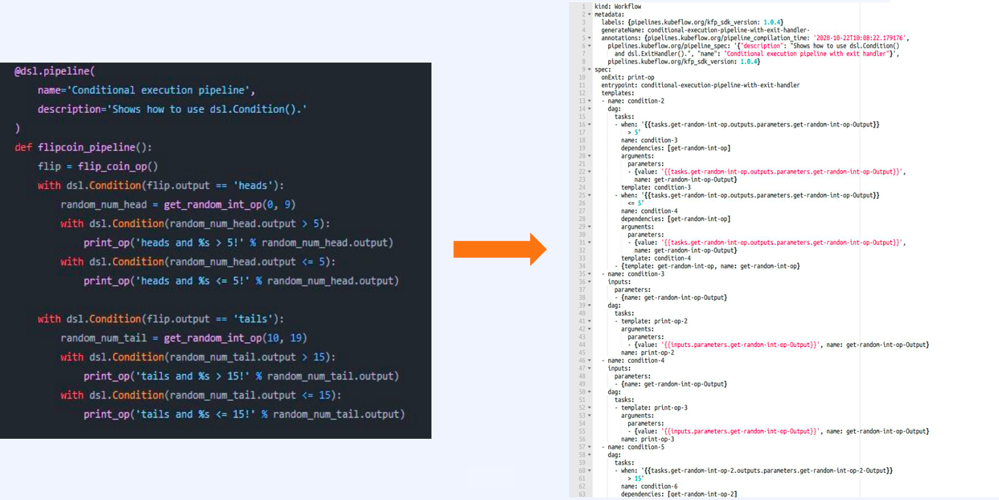
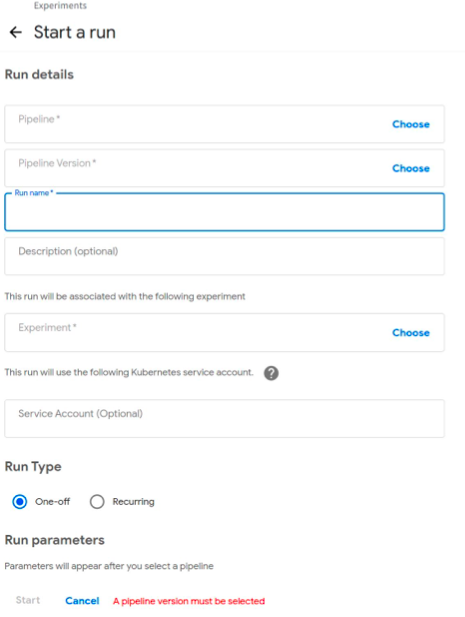

# 2. Kubeflow Pipelines (KFP)

## 2.1 Kubeflow Pipeline 이란

- 머신러닝 workflow를 DAG(비순환 그래프) 형태로 정의한 것
- kubeflow에 배포 후 run 하면 pipeline을 구성하는 각각의 component들이 k8s 위에서 pod으로 생성되어 서로 데이터를 주고 받으며 흘러간다.
- 즉, model을 serving 까지 보내는 데 필요한 모든 작업을 재사용 가능한 단위(component)로 나누고, k8s 위에서 연결시켜주는 역할을 한다.

## 2.2 Kubeflow Pipeline의 목표

- End to End Orchestration
  - 모델 연구 및 학습 과정과 서빙 과정의 괴리가 없도록 하는 것
- Easy Experimentation
  - 다양한 configuration에 따라 수많은 시도를 쉽게 하는 것
- Easy Re-Use
  - 잘 설계된 kfp component들은 재사용이 가능하므로, 새로운 pipeline을 만들 때의 작업 효율 향상

## 2.3 Kubeflow Pipeline Overview

- [https://www.kubeflow.org/docs/components/pipelines/overview/](https://www.kubeflow.org/docs/components/pipelines/overview/)

## 2.4 Kubeflow Pipelines 생성 방법

- Kubeflow Pipeline은 ML workflow를 DAG로 표현한 것이다. (사용자 관점)
-  쿠버네티스 입장에서 Kubeflow Pipeline은 `kind`가 `Workflow` 인 하나의 Argo workflow라는 Custom Resource이다.
- Argo workflow에 desired states를 포함한 yaml 파일을 위의 오른쪽과 같이 직접 작성하는 것은 매우 어려운 일이다.
- Kubeflow에서는 사용자가 위의 왼쪽 그림과 같이 파이썬 코드를 작성하고 컴파일하면 쿠버네티스가 이해할 수 있는 형태의 Argo workflow yaml 파일을 만들어주는 Python SDK와 DSL compiler를 제공한다.

## 2.5 Kubeflow Pipelines 실행 방법

- 위와 같은 방법을 통해 만든 pipeline yaml 파일을 쿠버네티스 위에서 실행시킬 수 있는 방법들은 다음과 같다.
  - UI
  - CLI
  - REST API
  - Python SDK

### 2.5.1 UI

- 컴파일된 Kfp yaml 파일을 UI를 통해서 업로드하고 아래와 같은 화면을 통해 실행시킬 수 있다.

- Sample UI

  

### 2.5.2 CLI

- Kfp 파이썬 패키지에서 제공하는 Kfp CLI를 통해서도 pipeline yaml 파일을 업로드하거나 실행시키는 것이 가능하다.

### 2.5.3 REST API

- 직접 HTTP Request 를 보내서 실행할 수 있다.

### 2.5.4 Python SDK

- 각각의 Kfp API에 대한 파이썬 클라이언트도 제공하고 있기 때문에 해당 Python SDK를 사용해서도 실행할 수 있다.

## 2.6 Kubeflow Pipelines Architecture

- 사용자가 kubeflow pipeline 이라는 리소스를 실행하는 것을 요청했을 때, Request의 흐름이 어떻게 이루어지면서 어떠한 리소스들이 생성되는 지를 확인하면 좋다.
- Kubeflow Pipeline은 Pipeline이라는 리소스를 중심으로 모든 동작이 수행된다.
- 가장 먼저 사용자는 Pipeline을 만든다.
  - Pipeline 생성 시 Kfp의 Python SDK를 사용해서 파이썬 코드로 짠 파이프라인에 대한 정보를 DSL compiler를 통해서 파이프라인의 실행 정보를 담고 있는 yaml 파일을 생성한다.
- 사용자는 생성한 yaml 파일을 UI나 CLI를 통해서 실행 요청을 할 수 있다.
- 파이프라인을 실행하게 되면, k8s API 서버에서는 Argo workflow 라는 kind를 갖는 리소스로 인식하여 Etcd에 해당 정보를 저장한다.
- 이 리소스에 대한 이벤트를 감시하고 있던 Kubeflow/Pipeline Orchestration Controllers는 해당 이벤트를 트리거로 삼아 Argo workflow를 생성한다.
- workflow를 구성하는 각각의 step은 결국엔 최소 단위인 Pod로 실행되기 때문에 이 과정에서 쿠버네티스의 pod controller가 개입하여 pod를 생성한다.
- 각각의 스텝, Pod, Kfp component의 실행 결과는 artifact store인 Minio에 저장된다.

- 위 과정은 Go 언어를 사용하여 수행된다.

