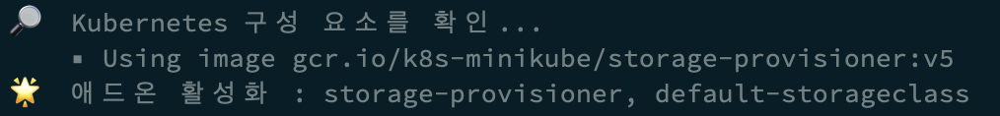
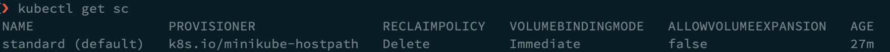
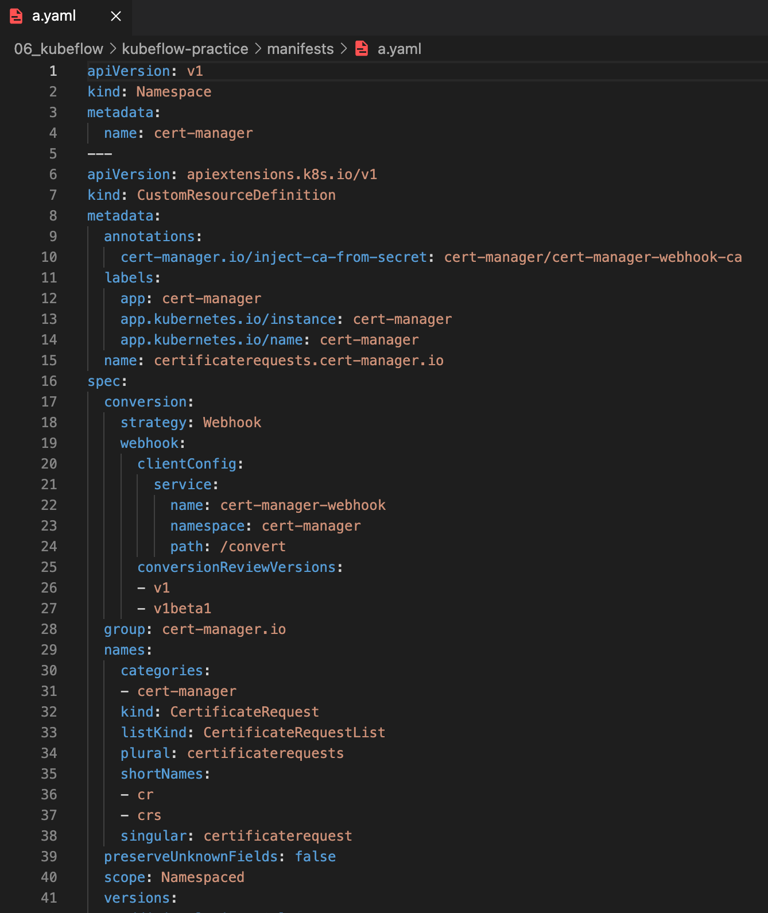

# 3. Kubeflow 설치

## 3.1 Prerequisite 개념

### 3.1.1 kustomize

- Helm과 비슷한 역할을 담당
- 여러 개의 yaml 파일들을 쉽게 관리하기 위한 도구
- 여러 리소스들의 configuration을 탬플릿(**base**)과 customization한 부분(**overlay**)을 나누어서 관리할 수 있는 도구
- `customize build` 명령을 통해, base + overlay가 merge된 형태의 yaml 파일들을 생성할 수 있다.


## 3.2 설치 방법

### 3.2.1 Kfctl

- v1.2 이후로는 공식적으로 지원하지 않음


### 3.2.2 Minikf

- 아직 v1.3 까지만 릴리즈
- kubeflow가 이미 설치되어 있는 VM 이미지를 사용하여 Vagrant 쉽게 설치 가능


### 3.2.3 Kubeflow manifests

- **공식** 릴리즈 관리용 repository
- [https://github.com/kubeflow/manifests](https://github.com/kubeflow/manifests)
- Kustomize v3 기반으로 manifests 파일 관리
- 가장 정석적인 방법


## 3.3 Kubeflow 설치

### 3.3.0 Prequisite

#### 3.3.0.1 Kubernetes 환경

- 버전
  - v1.17 ~ v1.21
  - v1.19.3 사용
- Default SotrageClass
  - Dynamic Provisioning 지원하는 storageclass
  - `minikube start` 시 설정
- TokenRequest API 활성화
  - alpha version의 API 이므로, k8s APIServer에 해당 feature gate를 설정해주어야 한다.
  - `minikube start` 시 설정


#### 3.3.0.2 Kustomize

- 버전
  - v3.x
  - M1 Mac은 v4.2.0 부터 사용 가능하므로 해당 버전 사용


### 3.3.1 kustomize 설정

#### 3.3.1.1 바이너리 다운

- OS 에 맞는 바이너리 다운로드

- M1 Mac은 v4.2.0부터 지원
- [https://github.com/kubernetes-sigs/kustomize/releases/tag/kustomize%2Fv4.2.0](https://github.com/kubernetes-sigs/kustomize/releases/tag/kustomize%2Fv4.2.0)

```bash
# darwin_arm64
wget https://github.com/kubernetes-sigs/kustomize/releases/download/kustomize%2Fv4.2.0/kustomize_v4.2.0_darwin_arm64.tar.gz
```

```bash
# 압축 해제
tar -zxvf kustomize_v4.2.0_darwin_arm64.tar.gz
```


#### 3.3.1.2 file mode 변경

```bash
# 실행 권한 부여
chmod +x kustomize
```


#### 3.3.1.3 바이너리 등록

```bash
sudo mv kustomize /usr/local/bin/kustomize
```


#### 3.3.1.4 버전 확인

```bash
kustomize version
```


### 3.3.2 minikube start

```bash
minikube start --driver=docker \
--cpus='4' --memory='6g' \
--kubernetes-version=v1.19.3 \
--extra-config=apiserver.service-account-signing-key-file=/var/lib/minikube/certs/sa.key \
--extra-config=apiserver.service-account-issuer=kubernetes.default.svc
```

- docker driver option
- cpu 4개 할당
- memory 7g 할당
- kubernetes version v1.19.3 설정
- `--extra-config` 부분은 tokenRequest 활성화 관련 설정


- 다음과 같이 `default-storageclass` 는 기본으로 addon이 활성화 되어 있음

  <div></div>

  ```bash
  # "standard" 라는 default storage 생성 확인
  kubectl get sc
  ```

  <div></div>


### 3.3.3 Git clone kubeflow/manifests

- kubeflow/manifests repository를 로컬 폴더에 git clone 한다.
- [https://github.com/kubeflow/manifests](https://github.com/kubeflow/manifests)

```bash
# git clone
git clone https://github.com/kubeflow/manifests.git

cd manifests

# v1.4.0 태그 시점으로 git checkout
git checkout tags/v1.4.0
```


### 3.3.4 kubeflow 구성 요소 설치

- 각각의 kubeflow 구성 요소를 순서대로 설치

- [https://github.com/kubeflow/manifests/tree/v1.4.0](https://github.com/kubeflow/manifests/tree/v1.4.0)

- 위 링크에서 v1.4.0 의 README에서 Installation 부분 확인하여 순서에 맞게 구성 요소 설치

- 이번 실습 때 설치하지 않는 구성 요소

  - Knative

  - KFServing

  - Training Operator

  - MPI Operator


#### 3.3.4.1 kustomize build 동작 확인

- `kustomize build` 명령어가 잘 실행되는 지 예시 확인

```bash
kustomize build common/cert-manager/cert-manager/base > a.yaml
```

- `kustomize build` 실행 결과를 `a.yaml` 로 저장하여 확인

<div></div>

- 여러 개의 yaml 파일들이 하나의 document 안에 정의된 것 확인


#### 3.3.4.2 파이프 연산자 활용 apply

- `|` (pipe) 연산자를 활용하여 `kustomize build` 의 결과물을 `kubectl apply -f -` 하여 적용할 수 있다.


#### 3.3.4.3 각각의 구성 요소 설치

- 각각의 구성 요소가 Running 이 될 때까지 대기한 후 다음 구성 요소 설치


**(1) cert-manager**

- 인증 및 인가 과정에서 certification을 발급해주는 역할 수행

- `cert-manager` 가 설치된 이후 `kubeflow-issuer`를 설치해야 한다.

```bash
kustomize build common/cert-manager/cert-manager/base | kubectl apply -f -
kustomize build common/cert-manager/kubeflow-issuer/base | kubectl apply -f -
```


**(2) Istio**

- 인증 및 인가 관리

```bash
kustomize build common/istio-1-9/istio-crds/base | kubectl apply -f -
kustomize build common/istio-1-9/istio-namespace/base | kubectl apply -f -
kustomize build common/istio-1-9/istio-install/base | kubectl apply -f -
```


**(3) Dex**

- 인증 및 사용자 관리

```bash
kustomize build common/dex/overlays/istio | kubectl apply -f -
```


**(4) OIDC AuthService**

- 인증 및 사용자 관리

```bash
kustomize build common/oidc-authservice/base | kubectl apply -f -
```


**(5) Kubeflow Namespace**

```bash
kustomize build common/kubeflow-namespace/base | kubectl apply -f -
```


**(6) Kubeflow Roles**

```bash
  kustomize build common/kubeflow-roles/base | kubectl apply -f -
```


**(7) Kubeflow Istio Resources**

- Istio를 통해서 gateway 역할을 수행할 구성 요소 설치

```bash
kustomize build common/istio-1-9/kubeflow-istio-resources/base | kubectl apply -f -
```


**(8) Kubeflow Pipelines**

- 설치 순서가 보장되어야 하기 때문에 `error` 가 표출되면 아래 명령어를 다시 한번 실행시켜주면 된다.

```bash
kustomize build apps/pipeline/upstream/env/platform-agnostic-multi-user | kubectl apply -f -
```


**(9) Katib**

```bash
kustomize build apps/katib/upstream/installs/katib-with-kubeflow | kubectl apply -f -
```


**(10) Central Dashboard**

```bash
kustomize build apps/centraldashboard/upstream/overlays/istio | kubectl apply -f -
```


**(11) Admission Webhook**

```bash
kustomize build apps/admission-webhook/upstream/overlays/cert-manager | kubectl apply -f -
```


**(12) Notebooks**

**(12-1)  Notebook Controller**

- 사용할 노트북을 생성해주는 역할을 담당하는 컨트롤러 설치

```bash
kustomize build apps/jupyter/notebook-controller/upstream/overlays/kubeflow | kubectl apply -f -
```


**(12-2) Jupyter Web App**

- central dashboard에서 노트북 서버를 생성할 수 있는 화면 UI를 담당하는 Jupyter Web App 설치

```bash
kustomize build apps/jupyter/jupyter-web-app/upstream/overlays/istio | kubectl apply -f -
```


**(13) Profiles + KFAM**

- kubeflow 각 사용자들의 프로필을 관리하는 Profiles와 KFAM 설치

```bash
kustomize build apps/profiles/upstream/overlays/kubeflow | kubectl apply -f -
```


**(14) Volumes Web App**

```bash
kustomize build apps/volumes-web-app/upstream/overlays/istio | kubectl apply -f -
```


**(15) Tensorboard**
**(15-1) Tensorboards Web App**

```bash
kustomize build apps/tensorboard/tensorboards-web-app/upstream/overlays/istio | kubectl apply -f -
```


**(15-2) Tensorboard Controller**

```bash
kustomize build apps/tensorboard/tensorboard-controller/upstream/overlays/kubeflow | kubectl apply -f -
```


**(16) User Namespace**

- 아래 명령어를 통해 생성한 user profile을 통해서 central dashboard를 띄운 다음에 해당 user의 접속 정보를 통해 접속할 것이다.
  - default user name : `kubeflow-user-example-com`

```bash
kustomize build common/user-namespace/base | kubectl apply -f -
```


#### 3.3.4.4 모든 구성 요소가 설치될 때까지 대기

```bash
kubectl get pod -A
```

- 상당히 많은 구성 요소들의 docker image를 로컬 머신에 pull 받기 때문에, 최초 실행 시에는 네트워크 상황에 따라 약 30분 정도까지 소요될 수 있음
- 여러 구성 요소들의 상태가 `PodInitializing` -> `ContainerCreating` 으로 진행되지만 시간이 오래 걸리는 경우 => 정상적인 상황
- 상태가 `Error` -> `CrashLoopBackOff` 인 경우 => minikube start 시의 설정을 다시 확인


#### 3.3.4.5 kubeflow pod 생성 확인

```bash
kubectl get pod -n kubeflow
```


## 3.4 Kubeflow 접속

### 3.4.1 포트 포워딩

```bash
kubectl port-forward svc/istio-ingressgateway -n istio-system 8080:80
```

- gateway를 포트 포워딩하여 `localhost:8080` 으로 kubeflow 대시보드에 접속
- 해당 명령어를 실행한 터미널을 열어놔야 대시보드에 접속할 수 있다.


### 3.4.2 접속 정보

- kubeflow manifests 배포 시, user 접속 정보 관련 설정을 변경하지 않은 경우의 default 접속 정보는 다음과 같다.
- ID
  - `user@example.com`
- PW
  - `12341234`


## 3.5 유용한 tool

### 3.5.1 kubectx & kubens

- kubernetes의 current-context와 kubernetes의 current-namespace를 변경할 수 있는 툴
- 여러 개의 context나 namespace를 다루는 경우에 유용하게 사용할 수 있음
- [https://github.com/ahmetb/kubectx](https://github.com/ahmetb/kubectx)
  - Install 방법도 매우 간편

- ex) `kubens kubeflow`
  - 현재 바라보고 있는 namespace가 `kubeflow`로 변경됨


### 3.5.2 kubectl-alias

- kubectl 관련 여러 명령어에 대한 alias를 자동 생성
- 자주 사용하는 명령을 쉽게 수행할 수 있음
- [https://github.com/ahmetb/kubectl-aliases](https://github.com/ahmetb/kubectl-aliases)
- ex) `kubectl get pod` -> `kgpo`
- ex) `kubectl get deployment` -> `kgdepw`


